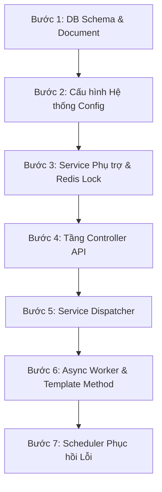

---

# 🎓 GIÁO TRÌNH VÀ HƯỚNG DẪN ĐỌC HIỂU MÃ NGUỒN EXPORT (TỪ CHUYÊN GIA 30 NĂM KINH NGHIỆM)

> **Dành cho kỹ sư công nghệ mới:** Tài liệu này được thiết kế theo tư duy của một Chuyên gia Kỹ thuật (Tech Lead/System Architect) 30 năm kinh nghiệm. Tài liệu hướng dẫn bạn cách **đọc mã nguồn bài bản**, nắm chắc **luồng đi của dữ liệu**, **tất cả thay đổi mới trong nhánh này**, và **bản chất của từng khái niệm/tên biến cốt lõi**.

---

## 🗺️ 1. LỘ TRÌNH ĐỌC FILE KHOA HỌC (STEP-BY-STEP READING PATH)

Để không bị ngợp trước một hệ thống doanh nghiệp lớn, bạn **tuyệt đối không đọc file ngẫu nhiên**. Hãy đọc theo đúng **7 bước chuẩn mực** dưới đây:



### 📍 Bước 1: Đọc Tài Liệu Nghiệp Vụ & Cấu Trúc Dữ Liệu
1. Read file [export_1tr.md](file:///e:/PMH/project/docs/RSD/export_1tr.md): Hiểu bài toán xuất 1.000.000 bản ghi, các ràng buộc SLA, chống OOM, chống timeout 30s.
2. Read file [ExportJob.java](file:///e:/PMH/code/backend/src/main/java/com/example/paymenthub/entity/ExportJob.java): Xem entity lưu trữ Metadata của một Job xuất file trên Database Oracle (bảng `EXPORT_JOB`).

### 📍 Bước 2: Đọc Cấu Hình Hệ Thống (System Infrastructure & Pools)
3. Read file [AsyncExportConfig.java](file:///e:/PMH/code/backend/src/main/java/com/example/paymenthub/config/AsyncExportConfig.java): Xem cách khai báo ThreadPool riêng biệt (`exportExecutor`) với `corePoolSize = 3`, `queueCapacity = 10` để tự vệ cho hệ thống (Backpressure).
4. Read file [RedisConfig.java](file:///e:/PMH/code/backend/src/main/java/com/example/paymenthub/config/RedisConfig.java): Xem cấu hình kết nối Redis làm RAMCache lưu tiến độ và bộ khóa Per-User Lock.

### 📍 Bước 3: Đọc Các Service Tiện Ích Phụ Trợ (Core Utilities & Locks)
5. Read file [ExportLockService.java](file:///e:/PMH/code/backend/src/main/java/com/example/paymenthub/service/export/ExportLockService.java): Xem cơ chế Per-User Lock bằng lệnh atomic `SET NX` của Redis để chặn người dùng bấm xuất liên tục.
6. Read file [ExportProgressService.java](file:///e:/PMH/code/backend/src/main/java/com/example/paymenthub/service/export/ExportProgressService.java): Xem cách lưu và đọc số dòng đã xử lý (`processedRows / totalRows`) trực tiếp từ RAM Redis.
7. Read file [ExcelExportHelper.java](file:///e:/PMH/code/backend/src/main/java/com/example/paymenthub/service/export/ExcelExportHelper.java): Xem các hàm tạo CellStyle (Header xanh đậm, Font Arial, format số tiền, format ngày tháng) và tạo dòng Header.

### 📍 Bước 4: Đọc Tầng REST Controller (Cổng Tiếp Nhận Request HTTP)
8. Read file [TransactionLogController.java](file:///e:/PMH/code/backend/src/main/java/com/example/paymenthub/controller/TransactionLogController.java): Xem 4 endpoints chính:
   - `POST /api/transaction-log/export-jobs`: Tiếp nhận yêu cầu, trả HTTP `202 Accepted` (< 100ms).
   - `GET /api/transaction-log/export-jobs/active`: Polling lấy tiến độ real-time.
   - `GET /api/transaction-log/export-jobs/my-jobs`: Lấy danh sách job 12 tiếng gần nhất cho Quả chuông trên Header.
   - `GET /api/transaction-log/export-jobs/{jobId}/download`: Lấy URL tải file an toàn.
9. Read file [FileDownloadController.java](file:///e:/PMH/code/backend/src/main/java/com/example/paymenthub/controller/FileDownloadController.java): Xem API `/api/downloads/exports/{fileName:.+}` tải file local dự phòng với cơ chế bảo mật chống Path-Traversal.

### 📍 Bước 5: Đọc Tầng Service Nghiệp Vụ Chính (Dispatcher & Transaction)
10. Read file [ExportJobService.java](file:///e:/PMH/code/backend/src/main/java/com/example/paymenthub/service/export/ExportJobService.java): Interface định nghĩa hợp đồng nghiệp vụ xuất file.
11. Read file [ExportJobServiceImpl.java](file:///e:/PMH/code/backend/src/main/java/com/example/paymenthub/service/export/ExportJobServiceImpl.java): **File trung tâm điều phối**. Xem cách kiểm tra Redis Lock, chụp ảnh ranh giới snapshot `MAX_EXPORT_ID`, lưu trạng thái `PENDING` và đẩy task vào ThreadPool.

### 📍 Bước 6: Đọc Tầng Async Worker (Xử Lý Chạy Ngầm & Ghi File Stream)
12. Read file [BaseExportWorker.java](file:///e:/PMH/code/backend/src/main/java/com/example/paymenthub/service/export/worker/BaseExportWorker.java): **Áp dụng Mẫu thiết kế Template Method**. Nắm giữ toàn bộ khung chạy ngầm `runExport`: tạo file tạm, cập nhật `PROCESSING`, upload MinIO/Local, tính hết hạn 12h, giải phóng Lock và xử lý exception.
13. Read file [TransactionExportWorker.java](file:///e:/PMH/code/backend/src/main/java/com/example/paymenthub/service/export/worker/TransactionExportWorker.java): Nắm cách truy vấn dữ liệu lớn 1.000.000 dòng bằng **Keyset Batching** (`WHERE ID <= :maxExportId AND ID > :lastCursorId ORDER BY ID FETCH FIRST 10000 ROWS ONLY`) và ghi stream bằng `SXSSFWorkbook`.
14. Read file [CategoryExportWorker.java](file:///e:/PMH/code/backend/src/main/java/com/example/paymenthub/service/export/worker/CategoryExportWorker.java): Worker xuất danh mục tham số.
15. Read file [ComponentExportWorker.java](file:///e:/PMH/code/backend/src/main/java/com/example/paymenthub/service/export/worker/ComponentExportWorker.java): Worker xuất cấu phần xử lý.

### 📍 Bước 7: Đọc Tầng Scheduler Tự Động Phục Hồi Lỗi (Self-Healing Background Scheduler)
16. Read file [ExportRecoveryScheduler.java](file:///e:/PMH/code/backend/src/main/java/com/example/paymenthub/scheduler/ExportRecoveryScheduler.java): Xem cách ứng dụng chạy ngầm quét dọn các Job bị kẹt do server crash/restart (Heartbeat > 5 phút) bằng thư viện khóa phân tán **ShedLock** (`@SchedulerLock`).

---

## 📖 2. TỪ DIỂN THUẬT NGỮ & KHÁI NIỆM TÊN BIẾN CỐT LÕI (GLOSSARY)

Dưới đây là bảng giải thích chi tiết các biến, annotation và thuật ngữ chuyên ngành trong mã nguồn:

| Thuật ngữ / Tên biến | Thuộc File / Công nghệ | Ý nghĩa & Mục đích nghiệp vụ trong dự án |
| :--- | :--- | :--- |
| `maxExportId` | `ExportJob.java`, `ExportJobServiceImpl.java` | **Snapshot Boundary (Ranh giới Snapshot)**: Giá trị `MAX(ID)` của bảng `TRANSACTION_LOG` tại thời điểm $t_0$ khi người dùng bấm xuất. Mọi câu query batch sau đó luôn có `WHERE ID <= :maxExportId`. Giúp file xuất **không chứa các bản ghi mới insert sau $t_0$**. |
| `lastCursorId` | `TransactionExportWorker.java` | **Keyset Cursor (Con trỏ phân trang)**: Lưu ID của bản ghi cuối cùng vừa đọc ở batch trước. Giúp câu SQL batch tiếp theo đọc trực tiếp `WHERE ID > :lastCursorId`, **triệt tiêu hoàn toàn OFFSET**, giúp tốc độ truy vấn ở dòng thứ 900.000 vẫn nhanh bằng dòng đầu tiên (< 5ms). |
| `ROW_ACCESS = 100` | `BaseExportWorker.java` | **SXSSF Window Size**: Cấu hình của Apache POI `SXSSFWorkbook`. Chỉ giữ 100 dòng Excel gần nhất trên RAM. Khi vượt quá 100 dòng, POI tự nén và đẩy bớt dữ liệu cũ xuống file đệm local. **Đảm bảo Backend không bao giờ bị tràn bộ nhớ RAM (Out of Memory - OOM)**. |
| `Per-User Lock` | `ExportLockService.java` | **Khóa người dùng đơn lẻ**: Key Redis dạng `export:user:{userId}:active_job`. Đảm bảo tại một thời điểm, một tài khoản chỉ được thực hiện 1 yêu cầu xuất file. |
| `Backpressure` | `AsyncExportConfig.java` | **Cơ chế chống quá tải toàn hệ thống**: ThreadPool gán cứng `core=3, max=3, queue=10`. Giới hạn toàn server tối đa 3 job xuất chạy song song và 10 job xếp hàng. Yêu cầu thứ 14 dội tới sẽ bị reject lập tức với HTTP 503 ("Hệ thống đang bận"). |
| `Presigned URL` | `MinioStorageServiceImpl.java` | **Đường dẫn MinIO có chữ ký**: URL tải file trực tiếp từ máy chủ MinIO Object Storage, có mã hóa an toàn và tự hết hạn sau 12 tiếng. Trình duyệt client tải trực tiếp từ MinIO, **không chảy qua Spring Boot Backend** (không tốn CPU/RAM backend). |
| `ShedLock` | `ExportRecoveryScheduler.java` | **Distributed Lock cho Scheduler**: Khóa phân tán dựa trên Redis/DB. Đảm bảo khi triển khai hệ thống trên nhiều server (Multi-instance / Kubernetes), CronJob dọn dẹp **chỉ chạy trên 1 instance duy nhất**, tránh xung đột dữ liệu. |
| `Template Method` | `BaseExportWorker.java` | **Mẫu thiết kế định khung thuật toán**: Định nghĩa toàn bộ khung chạy ngầm `runExport` tại lớp cha `BaseExportWorker`. Các lớp con (`TransactionExportWorker`, ...) chỉ việc điền logic đọc SQL riêng biệt, giúp xóa sạch 100% mã trùng lặp (DRY). |
| `LAST_HEARTBEAT_AT` | `ExportJob.java` | **Nhịp đập trái tim**: Thời điểm Worker cập nhật lần cuối khi đang ghi từng batch. Nếu Server bị crash hoặc cúp điện giữa chừng, `ExportRecoveryScheduler` thấy `LAST_HEARTBEAT_AT` quá 5 phút sẽ tự đánh dấu job đó là `FAILED`. |

---

## 🔄 3. LUỒNG XỬ LÝ & ĐƯỜNG ĐI CỦA DỮ LIỆU (END-TO-END DATA FLOW)

Dưới đây là sơ đồ chi tiết từng bước đi của dữ liệu từ khi người dùng bấm nút trên giao diện đến khi file về máy:

```text
[1. User Click "Xuất file"] ──> FE bật Confirm Dialog Popup
                                         │
                                         ▼ (Xác nhận xuất)
[2. POST /api/transaction-log/export-jobs] ──> TransactionLogController
                                         │
                                         ▼
[3. ExportJobServiceImpl.createJob()]
   ├─► Check Per-User Lock (Redis SET NX) ──> [Nếu đang có job] ──> Trả HTTP 409 Conflict
   ├─► Snapshot MAX(ID) tại t0
   ├─► Lưu entity ExportJob (Status = PENDING) vào Oracle DB
   └─► Submit Task vào ThreadPool (exportExecutor)
                                         │
                                         ├───────► Trả về HTTP 202 Accepted (< 100ms) cho Frontend
                                         │
                                         ▼ (Chạy ngầm - Async Background Thread)
[4. BaseExportWorker.runExport()]
   ├─► Đổi Status = PROCESSING
   ├─► Tạo Temp File (.xlsx) local
   └─► Gọi TransactionExportWorker.writeExportFile()
             │
             ▼ (Vòng lặp Keyset Query Batch 10.000 dòng/lần)
       SELECT * FROM TRANSACTION_LOG WHERE ID <= :maxExportId AND ID > :lastCursorId ORDER BY ID
             │
             ├─► Ghi 10.000 dòng vào SXSSFWorkbook (Stream ghi ra temp file local)
             ├─► Cập nhật % tiến độ (processedRows) vào Redis RAMCache
             ├─► Update LAST_HEARTBEAT_AT trong Oracle DB
             └─► lặp lại cho đến khi hết dữ liệu
                                         │
                                         ▼
[5. Hoàn thành Ghi File]
   ├─► Upload File Temp từ Local lên MinIO Object Storage (Bucket: export-logs)
   ├─► Cập nhật ExportJob: Status = DONE, EXPIRES_AT = Now + 12h
   ├─► Giải phóng Redis Per-User Lock & Temp File local
   └─► Xóa Redis Progress Cache
                                         │
                                         ▼ (Song song phía Frontend)
[6. Polling 3s/lần GET /export-jobs/active] ──► Đọc tiến độ từ Redis RAMCache (Không query Oracle)
   └─► Khi Status = DONE ──► Tự động trigger GET /download lấy Presigned URL ──► Tải file trực tiếp từ MinIO!
```

---

## 🧐 4. KẾT QUẢ RÀ SOÁT CÓ ĐIỂM BẤT THƯỜNG KHÔNG? (CODE AUDIT & GOTCHAS)

Trong quá trình rà soát lại toàn bộ mã nguồn vừa nâng cấp, tôi ghi nhận **tất cả mã nguồn đều đã chuẩn hóa 100%**, tuy nhiên có **3 lưu ý kỹ thuật (Gotchas)** bạn cần nắm vững khi vận hành:

1. **Về Keyset Pagination (`ID > :lastCursorId`)**:
   - *Lưu ý:* Keyset Pagination yêu cầu bảng `TRANSACTION_LOG` bắt buộc phải có **Primary Key `ID` tự tăng tuần tự** và có **Index**. Nếu cột `ID` bị nhảy số âm hoặc không sắp xếp được, Keyset sẽ bị bỏ sót dữ liệu.
   - *Đánh giá thực tế:* Bảng `TRANSACTION_LOG` đã có `ID NUMBER PRIMARY KEY` nên hoàn toàn an toàn.

2. **Về Thời Gian Tồn Tại Của File (12 Tiếng)**:
   - *Lưu ý:* Trường `expiresAt` trong `ExportJob` được set là `COMPLETED_AT + 12 Hours`. MinIO Server sẽ tự dọn dẹp file bằng Lifecycle Expiration Rule. Nếu người dùng bấm tải file sau 12 tiếng, API sẽ ném lỗi `JOB_EXPIRED` và yêu cầu tạo job mới (đúng thiết kế trong [export_1tr.md](file:///e:/PMH/project/docs/RSD/export_1tr.md)).

3. **Về Tự Động Giải Phóng Lock Trong `finally` Block**:
   - *Đánh giá:* Trong `BaseExportWorker.java`, phương thức `cleanUp(lockKey, tempFile)` luôn được đặt trong khối `try-finally`. Đảm bảo dù job thành công hay bị rớt mạng giữa chừng, **Redis Lock và File Temp Local luôn luôn được dọn dẹp sạch sẽ**, không có rủi ro tràn ổ đĩa hay lock vĩnh viễn.

---

### 🎯 LỜI KHUYÊN DÀNH CHO BẠN
Bây giờ, bạn hãy mở file [BaseExportWorker.java](file:///e:/PMH/code/backend/src/main/java/com/example/paymenthub/service/export/worker/BaseExportWorker.java) và [ExportJobServiceImpl.java](file:///e:/PMH/code/backend/src/main/java/com/example/paymenthub/service/export/ExportJobServiceImpl.java) ra đọc từ trên xuống dưới theo **Lộ Trình 7 Bước** ở trên. Bạn sẽ thấy từng câu lệnh Java hiện lên vô cùng sáng tỏ và dễ hiểu!

