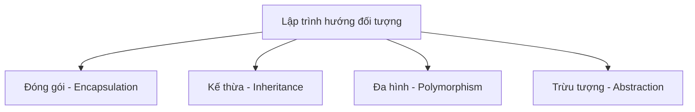
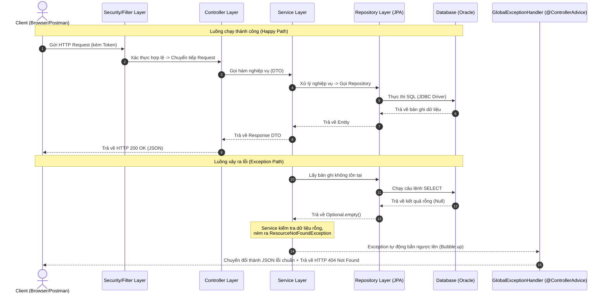
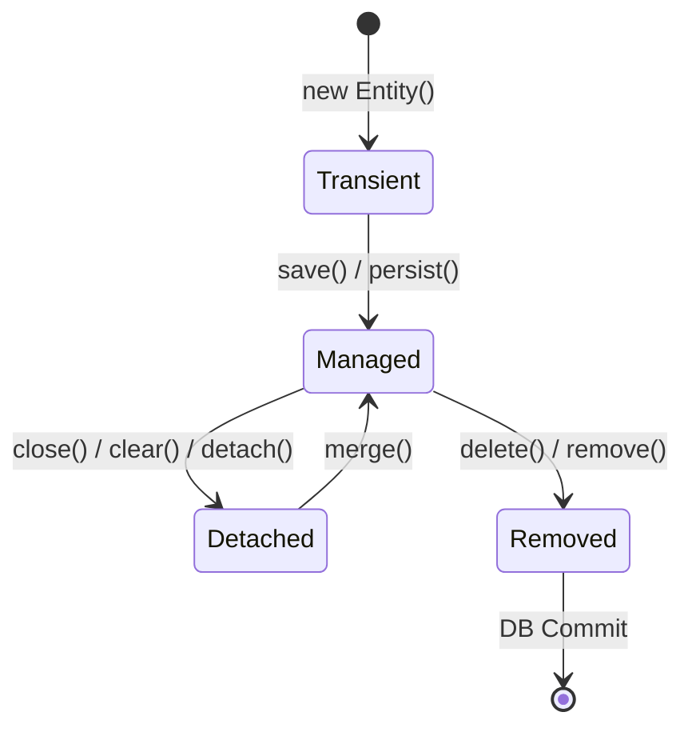

# Tài liệu Ôn tập Kiến thức Java Backend & OOP (Learn 06)

Tài liệu này tổng hợp câu trả lời chi tiết và chuẩn kiến trúc cho 8 câu hỏi ôn tập của bạn về Java Backend (Spring Boot, JPA, Transaction) và Lập trình hướng đối tượng (OOP).

---

## 1. Ý nghĩa các Annotation phổ biến trong Spring Boot Backend

Các Annotation (Chú thích) trong Spring Boot giúp cấu hình ứng dụng một cách khai báo (Declarative), giảm thiểu code cấu hình XML rườm rà.

### A. Spring Core & Web / Routing Annotations
*   **`@SpringBootApplication`**: Đặt ở lớp khởi chạy chính. Tích hợp `@SpringBootConfiguration`, `@EnableAutoConfiguration` và `@ComponentScan` để tự động hóa cấu hình Spring.
*   **`@RestController`**: Đánh dấu Controller xử lý REST API, tự động serialize kết quả trả về của hàm thành JSON/XML (tích hợp `@Controller` và `@ResponseBody`).
*   **`@Service`**: Đăng ký lớp chứa logic xử lý nghiệp vụ (Business Logic).
*   **`@Repository`**: Đăng ký lớp thao tác cơ sở dữ liệu (DAO), hỗ trợ dịch lỗi JDBC/SQL thành Exception runtime của Spring.
*   **`@Component`**: Đăng ký lớp thông thường làm Spring Bean.
*   **`@Autowired`**: Đánh dấu trường hoặc constructor để thực hiện Dependency Injection (DI) tự động tiêm Bean thích hợp.
*   **`@RequestMapping("/đường_dẫn")`**: Khai báo tiền tố đường dẫn URL dùng chung cho toàn bộ các API trong Controller.
*   **`@GetMapping` / `@PostMapping` / `@PutMapping` / `@DeleteMapping`**: Chỉ định HTTP Method cụ thể (GET, POST, PUT, DELETE) cho từng hàm xử lý endpoint trong Controller.
*   **`@PathVariable`**: Liên kết (bind) tham số trên đường dẫn động URL (ví dụ: `/api/group-category/{id}`) vào biến của hàm Java.
*   **`@RequestParam`**: Đọc các tham số truy vấn truyền trên URL dạng query string (ví dụ: `?paramName=MOMO`).
*   **`@RequestBody`**: Đọc dữ liệu Payload JSON được gửi lên từ Client và chuyển đổi nó thành Object Java (DTO).

### B. JPA / Hibernate Annotations
*   **`@Entity`**: Đánh dấu Java Class ánh xạ trực tiếp đến một Table trong Database.
*   **`@Table(name = "tên_bảng")`**: Chỉ định rõ tên bảng Database ánh xạ tới Entity.
*   **`@Id`**: Đánh dấu thuộc tính khóa chính (Primary Key).
*   **`@GeneratedValue`**: Cấu hình cơ chế tự động tạo khóa chính (IDENTITY, SEQUENCE, TABLE, AUTO).
*   **`@Column`**: Cấu hình chi tiết cho cột trong DB (như `name`, `nullable`, `length`, `updatable = false`).
*   **`@Version`**: Kích hoạt cơ chế **Khóa lạc quan (Optimistic Locking)** để kiểm soát xung đột đồng thời khi có nhiều người cùng chỉnh sửa một bản ghi.
*   **`@PrePersist` / `@PreUpdate`**: Đánh dấu các hàm trigger vòng đời của Entity trong JPA để tự động gán ngày tạo/ngày sửa trước khi bản ghi thực sự được ghi xuống DB.
*   **`@MappedSuperclass`**: Đánh dấu lớp cha chứa các thuộc tính dùng chung cho nhiều Entity (như `createdDate`, `updatedDate` trong `BaseEntity`) để các entity con kế thừa lại mà không cần định nghĩa lại cột.
*   **`@PersistenceContext`**: Tiêm (inject) đối tượng `EntityManager` của JPA để thực hiện các thao tác DB thủ công.
*   **`@Transactional`**: Đánh dấu ranh giới giao dịch (Transaction Boundary), tự động Commit khi thành công và Rollback khi có lỗi Runtime.
*   **`@Procedure`**: Khai báo gọi stored procedure trực tiếp từ Database Oracle trong lớp Repository.
*   **`@Param`**: Liên kết tham số của hàm Java vào biến trong câu lệnh SQL hoặc Stored Procedure.
*   **`@Query`**: Định nghĩa câu lệnh truy vấn custom bằng JPQL hoặc Native SQL ngay trên phương thức Repository.

### C. Lombok Annotations (Auto-Code Generation)
*   **`@Getter` / `@Setter`**: Tự động sinh mã nguồn cho các hàm Getter/Setter của tất cả các trường trong Class khi biên dịch.
*   **`@NoArgsConstructor` / `@AllArgsConstructor`**: Tự động sinh hàm khởi tạo không tham số và hàm khởi tạo đầy đủ tham số.
*   **`@Builder`**: Tạo ra mẫu thiết kế Builder Pattern giúp khởi tạo đối tượng nhanh, dễ đọc dưới dạng chuỗi nối tiếp (Fluent API).
*   **`@Slf4j`**: Tự động khai báo đối tượng Logger `log` của SLF4J giúp ghi log hệ thống cực kỳ đơn giản.

### D. Validation Annotations (Kiểm định Dữ liệu DTO)
*   **`@Valid`**: Đặt trước `@RequestBody` trong Controller để kích hoạt cơ chế kiểm định dữ liệu (validation) tự động của Spring trước khi xử lý API.
*   **`@NotNull`**: Chặn dữ liệu trống (`null`).
*   **`@NotBlank`**: Chặn dữ liệu rỗng (không được phép để trống, null hoặc chỉ chứa khoảng trắng).
*   **`@Size(min, max)`**: Giới hạn độ dài tối thiểu và tối đa của chuỗi ký tự hoặc kích thước của mảng.

### E. Exception Handling Annotations (Xử lý Lỗi Toàn cục)
*   **`@RestControllerAdvice`**: Đánh dấu class xử lý lỗi tập trung toàn cục (Global Exception Handler) cho toàn bộ RestControllers.
*   **`@ExceptionHandler(TênLỗi.class)`**: Đánh dấu hàm bắt và xử lý một ngoại lệ (Exception) cụ thể khi nó bắn ra từ bất kỳ tầng nào của ứng dụng.

---

## 2. Constructor (Hàm khởi tạo) trong Java

Constructor là một phương thức đặc biệt của Class dùng để khởi tạo trạng thái ban đầu của đối tượng (Instance) khi được sinh ra.

### Đặc điểm của Constructor:
1.  **Tên trùng khớp hoàn toàn** với tên của Class (bao gồm cả chữ hoa/thường).
2.  **Không có kiểu trả về** (ngay cả kiểu `void` cũng không có).
3.  Được tự động kích hoạt duy nhất một lần khi ta dùng từ khóa **`new`** để tạo đối tượng:
    ```java
    User user = new User(); // Gọi constructor mặc định
    ```

### Các loại Constructor:
*   **Default Constructor (Khởi tạo mặc định):** Là constructor không có tham số. Nếu ta không viết bất kỳ constructor nào trong class, Java Compiler sẽ tự động tạo ra một Default Constructor rỗng.
*   **Parameterized Constructor (Khởi tạo có tham số):** Dùng để truyền dữ liệu khởi tạo trực tiếp khi tạo đối tượng.

### Từ khóa `this(...)` và `super(...)` trong Constructor:
*   **`this(...)`**: Dùng để gọi một Constructor khác của **chính Class đó**.
    *   *Lưu ý:* Lệnh `this(...)` phải đặt ở **dòng đầu tiên** trong thân của Constructor.
*   **`super(...)`**: Dùng để gọi Constructor của **Class Cha (Parent/Super class)**.
    *   *Lưu ý:* Phải đặt ở **dòng đầu tiên** trong thân của Constructor lớp con để lớp cha khởi tạo trước lớp con.

---

## 3. OOP (Object-Oriented Programming) - 4 Tính chất cốt lõi

Lập trình hướng đối tượng xoay quanh 4 tính chất nền tảng sau:



### 1. Đóng gói (Encapsulation)
*   **Ý nghĩa:** Che giấu chi tiết cài đặt bên trong đối tượng, chỉ cung cấp các phương thức công khai để tương tác. Giúp bảo vệ dữ liệu không bị thay đổi tùy tiện từ bên ngoài.
*   **Thực tế:** Các thuộc tính khai báo là `private`, truy cập và thay đổi gián tiếp thông qua các hàm Getter/Setter công khai (`public`).

### 2. Kế thừa (Inheritance)
*   **Ý nghĩa:** Cho phép một lớp con (`Child`) thừa hưởng lại tất cả các thuộc tính và phương thức được phép (public, protected) từ lớp cha (`Parent`). Giúp tái sử dụng code tối đa.
*   **Thực tế:** Dùng từ khóa **`extends`** (ví dụ: `class Dog extends Animal`).

### 3. Đa hình (Polymorphism)
*   **Ý nghĩa:** Một hành động có thể được thực hiện theo nhiều cách khác nhau tùy thuộc vào đối tượng thực thi.
*   **Thực tế:**
    *   **Ghi đè (Overriding - Đa hình lúc chạy / Runtime):** Lớp con viết lại hoàn toàn thân hàm của lớp cha.
    *   **Nạp chồng (Overloading - Đa hình lúc biên dịch / Compile-time):** Nhiều hàm cùng tên trong 1 class nhưng khác nhau về số lượng hoặc kiểu dữ liệu của tham số đầu vào.

### 4. Trừu tượng (Abstraction)
*   **Ý nghĩa:** Chỉ tập trung vào việc định nghĩa đối tượng "làm cái gì" (Hợp đồng) chứ không đi sâu vào việc "làm thế nào" (Cài đặt chi tiết). Giúp giảm sự phức tạp của hệ thống.
*   **Thực tế:** Thể hiện qua việc khai báo các **`interface`** hoặc **`abstract class`**.

---

## 4. Mô hình luồng đi của 1 Request trong Spring Boot (Three-Layer Architecture)

Dưới đây là mô hình tuần tự mô tả đường đi của một HTTP Request từ Client xuyên qua các package trong Spring Boot 3 lớp, bao gồm cả **Luồng xử lý lỗi (Exception Flow)**:

### Sơ đồ luồng đi (Mermaid Sequence Diagram)



### Giải thích luồng Exception:
1.  Nếu xảy ra ngoại lệ ở bất kỳ tầng nào (ví dụ: DB bị sập ở Repository, logic nghiệp vụ lỗi ở Service, dữ liệu đầu vào không hợp lệ ở Controller), Exception sẽ tự động **ném ngược lên** các lớp gọi nó.
2.  Spring Boot có một bộ chặn toàn cục gọi là **`GlobalExceptionHandler`** (được đánh dấu bằng `@ControllerAdvice`).
3.  Lớp này chứa các phương thức `@ExceptionHandler(TênNgoạiLệ.class)` sẽ bắt lấy Exception tương ứng, đóng gói nó thành đối tượng lỗi thống nhất (`ApiResponse` dạng lỗi) và trả về Client kèm mã HTTP thích hợp (như 400, 404, 500) để đảm bảo Client không bao giờ nhận về trang lỗi trắng hoặc lỗi raw stack-trace.

---

## 5. Sự khác biệt giữa Interface và Abstract Class (3 điểm cốt lõi)

Mặc dù cả hai đều dùng để thể hiện tính Trừu tượng, nhưng chúng có các mục đích thiết kế và khả năng kỹ thuật hoàn toàn khác nhau:

| Điểm khác biệt | Interface (Giao diện) | Abstract Class (Lớp trừu tượng) |
| :--- | :--- | :--- |
| **1. Bản chất & Mục đích thiết kế** | Là một **Bản hợp đồng mẫu** (Quy định hành vi). Các lớp implements nó không cần có quan hệ họ hàng với nhau (ví dụ: cả `Bird` và `Airplane` đều implement `Flyable`). | Là một **Lớp cha chung** (Quy định bản chất hệ thống). Thể hiện mối quan hệ kế thừa chặt chẽ (cha - con) (ví dụ: `Dog` và `Cat` kế thừa từ `Animal`). |
| **2. Đa kế thừa** | Một Class có thể ký hợp đồng (**`implements`**) với **nhiều** Interface khác nhau cùng lúc. | Một Class chỉ có thể kế thừa (**`extends`**) từ **một** Abstract Class duy nhất (Java không hỗ trợ đa kế thừa class). |
| **3. Thuộc tính & Phương thức** | *   Các thuộc tính mặc định luôn là hằng số (`public static final`).<br>*   Từ Java 8+, có thể có hàm có thân thông qua từ khóa `default` hoặc `static`. | *   Có thể chứa các thuộc tính thông thường (non-static, non-final) có trạng thái.<br>*   Có thể chứa cả hàm không có thân (abstract method) lẫn các hàm có thân đầy đủ với mọi cấp độ truy cập (`private`, `protected`, `public`). |

---

## 6. Bản chất của JPA (Java Persistence API)

### Bản chất JPA là gì?
JPA **không phải là phần mềm chạy được**. Nó chỉ là một **Đặc tả (Specification / Bộ quy ước)** gồm các Interface và tài liệu quy định cách ánh xạ dữ liệu trong Java xuống DB. 
*   **Hibernate** chính là phần mềm triển khai thực tế (Implementation) phổ biến nhất hiện nay hiện thực hóa các quy ước của JPA.

### Cách JPA tương tác với Database
JPA sử dụng cơ chế **ORM (Object-Relational Mapping)** để làm cầu nối:
*   Nó tự động ánh xạ (Map) các thuộc tính của Java Class (Entity) thành các cột của Database Table.
*   JPA hoạt động thông qua một công cụ quản lý gọi là **`EntityManager`**. Khi bạn thao tác với Java Object, `EntityManager` sẽ tự động chuyển đổi các thao tác đó thành các câu lệnh SQL (`SELECT`, `INSERT`, `UPDATE`, `DELETE`) thông qua JDBC Driver để chạy xuống Database.

### Bản chất của các hàm truy vấn mặc định:
*   **`save(entity)`**:
    *   JPA kiểm tra xem thực thể đã có ID chưa.
    *   Nếu **chưa có ID**: Nó hiểu là tạo mới $\rightarrow$ Gọi hàm `EntityManager.persist(entity)` $\rightarrow$ Sinh ra câu lệnh `INSERT INTO...`.
    *   Nếu **đã có ID**: Nó hiểu là cập nhật $\rightarrow$ Gọi hàm `EntityManager.merge(entity)` $\rightarrow$ Sinh ra câu lệnh `UPDATE...`.
*   **`delete(entity)`**:
    *   Nó lấy thực thể đó ra, chuyển trạng thái sang Removed $\rightarrow$ Gọi hàm `EntityManager.remove(entity)` $\rightarrow$ Sinh ra câu lệnh `DELETE FROM...`.

---

## 7. Các trạng thái vòng đời của một Entity trong JPA

Một đối tượng Entity trong JPA trải qua 4 trạng thái vòng đời chính được quản lý bởi **Persistence Context (EntityManager)**:



### 1. Transient (Mới khởi tạo)
*   **Đặc điểm:** Đối tượng vừa được tạo mới bằng từ khóa `new`.
*   **Trạng thái:** Chưa có dòng dữ liệu nào tương ứng dưới DB, chưa có ID, và **chưa** được quản lý bởi EntityManager.
*   **Hành động:** Nếu tắt ứng dụng hoặc mất đối tượng, dữ liệu sẽ biến mất hoàn toàn.

### 2. Managed (Đang được quản lý)
*   **Đặc điểm:** Thực thể đã được lưu vào Database và **đang nằm trong sự quản lý** của EntityManager (khi gọi `save()`, `persist()` hoặc khi query dữ liệu từ DB lên).
*   **Tính chất đặc biệt (Dirty Checking):** Ở trạng thái này, nếu bạn thay đổi bất kỳ thuộc tính nào của Entity (ví dụ: `user.setName("Đạt")`), JPA sẽ tự động phát hiện sự thay đổi và tự động chạy câu lệnh `UPDATE` xuống Database khi transaction kết thúc (commit), mà bạn **không cần gọi lại hàm `.save()`**.

### 3. Detached (Bị ngắt kết nối)
*   **Đặc điểm:** Đối tượng từng được quản lý bởi EntityManager, nhưng hiện tại phiên làm việc (Session/Transaction) đã đóng lại, hoặc ta chủ động ngắt kết nối (`EntityManager.detach()`, `clear()`).
*   **Trạng thái:** Dữ liệu dưới DB vẫn tồn tại, đối tượng Java vẫn tồn tại, nhưng mọi thay đổi trên đối tượng Java này sẽ **không tự động cập nhật** xuống DB nữa.
*   **Kết nối lại:** Dùng hàm `.merge()` để đưa đối tượng trở lại trạng thái Managed.

### 4. Removed (Đã đánh dấu xóa)
*   **Đặc điểm:** Thực thể được đánh dấu để xóa khỏi Database (khi gọi `delete()` hoặc `remove()`).
*   **Trạng thái:** Vẫn nằm trong bộ nhớ RAM tạm thời nhưng sẽ bị xóa thực tế khỏi Database ngay khi transaction kết thúc (commit hoặc flush).

---

## 8. Tìm hiểu về `@Transactional` trong Spring Boot

Annotation `@Transactional` dùng để quản lý các **Giao dịch (Transactions)** trong Database một cách tự động (Declarative Transaction Management).

### Ý nghĩa cốt lõi:
Nó đảm bảo tính chất **ACID** (đặc biệt là tính **Atomicity - Nhất quán nguyên tử**): *"Tất cả cùng thành công, hoặc tất cả cùng thất bại"*.
*   Nếu mọi câu lệnh SQL trong phương thức `@Transactional` chạy trơn tru $\rightarrow$ Hệ thống sẽ thực hiện **Commit** (Lưu vĩnh viễn dữ liệu xuống DB).
*   Nếu xảy ra bất kỳ lỗi runtime nào (`RuntimeException`) trong quá trình chạy $\rightarrow$ Hệ thống sẽ thực hiện **Rollback** (Hủy bỏ toàn bộ các lệnh SQL đã chạy trước đó trong phương thức, trả DB về trạng thái nguyên vẹn ban đầu).

### Cơ chế Lan truyền (Propagation):
Quy định cách các Transaction hành xử khi các hàm gọi lồng nhau. Có 2 loại propagation thường dùng nhất:

1.  **`Propagation.REQUIRED` (Mặc định):**
    *   *Hành vi:* Nếu hàm gọi trước đã có sẵn một Transaction rồi, hàm gọi sau sẽ **dùng chung** transaction đó. Nếu chưa có, nó sẽ tạo mới 1 transaction.
    *   *Tác động lỗi:* Nếu hàm sau xảy ra lỗi dẫn đến rollback, toàn bộ transaction chung (bao gồm cả hàm trước) sẽ bị rollback theo.
2.  **`Propagation.REQUIRES_NEW`:**
    *   *Hành vi:* Luôn luôn tạo một **Transaction mới hoàn toàn độc lập**. Transaction của hàm gọi trước sẽ bị tạm dừng (suspend) chờ Transaction mới này chạy xong rồi mới tiếp tục.
    *   *Tác động lỗi:* Nếu Transaction mới xảy ra lỗi và rollback, nó **không** làm ảnh hưởng hay rollback Transaction của hàm gọi trước (trừ khi hàm trước bắt lấy lỗi và chủ động xử lý khác).
