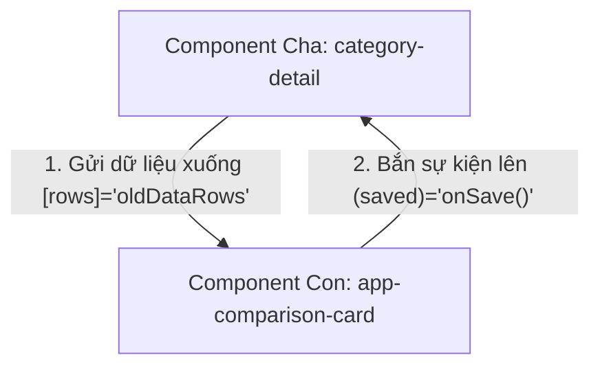

# Tài liệu Ôn tập Kiến thức Angular Frontend (Learn 07)

Tài liệu này tổng hợp toàn bộ lý thuyết nền tảng và bài học thực tiễn Frontend chúng ta đã ôn tập và thực hành trong dự án Payment Hub.

---

## 1. So sánh Toán tử Logical OR (`||`) và Nullish Coalescing (`??`)

Hai toán tử này đều dùng để gán giá trị mặc định khi giá trị trước đó bị trống, nhưng cách xác định "thế nào là trống" của chúng rất khác nhau.

### A. Toán tử Logical OR (`||`)
*   **Cơ chế:** Kích hoạt giá trị mặc định nếu biểu thức bên trái là giá trị **Falsy**.
*   **Falsy bao gồm:** `false`, `0`, `""` (chuỗi rỗng), `null`, `undefined`, và `NaN`.
*   **Nguy cơ thực tế:** Nếu giá trị của bạn hợp lệ là số `0` hoặc chuỗi rỗng `""`, toán tử `||` sẽ đè giá trị mặc định lên, gây mất mát dữ liệu.
    ```typescript
    const discount = 0 || 5; // Kết quả là 5 (Lỗi: người dùng được giảm giá 0% nhưng bị đổi thành 5%)
    ```

### B. Toán tử Nullish Coalescing (`??`)
*   **Cơ chế:** Chỉ kích hoạt giá trị mặc định khi biểu thức bên trái là **Nullish** (chỉ gồm `null` hoặc `undefined`).
*   **Bảo toàn dữ liệu:** Giữ nguyên các giá trị Falsy khác như `0`, `false`, `""` và `NaN`.
    ```typescript
    const discount = 0 ?? 5; // Kết quả là 0 (Đúng: giữ nguyên mức giảm giá 0%)
    ```

---

## 2. Truyền Dữ liệu Component qua `@Input` và `@Output`

Đây là cơ chế truyền dữ liệu nội bộ giữa các thành phần giao diện trên trình duyệt (không liên quan đến gọi mạng API).



### A. `@Input()` - Nhận dữ liệu từ Cha xuống Con
*   Được khai báo ở Component Con để mở cổng nhận dữ liệu.
*   *Ví dụ trong con ([comparison-card.ts](file:///e:/PMH/code/frontend/src/app/shared/components/comparison-card/comparison-card.ts)):*
    ```typescript
    @Input() title: string = '';
    @Input() rows: ComparisonRow[] = [];
    ```
*   *Cách truyền ở Cha:* Sử dụng cặp ngoặc vuông `[tên_input]="biến_ở_cha"`:
    ```html
    <app-comparison-card [title]="'Tiêu đề'" [rows]="oldDataRows"></app-comparison-card>
    ```

### B. `@Output()` - Bắn sự kiện từ Con lên Cha
*   Khai báo ở Component Con kèm theo đối tượng `EventEmitter` để phát ra tín hiệu (sự kiện) khi người dùng thao tác.
*   *Ví dụ trong con:*
    ```typescript
    @Output() confirmed = new EventEmitter<void>();
    onConfirmClick() {
      this.confirmed.emit(); // Bắn tín hiệu lên cha
    }
    ```
*   *Cách lắng nghe ở Cha:* Sử dụng cặp ngoặc đơn `(tên_sự_kiện)="hàm_ở_cha($event)"`:
    ```html
    <app-con (confirmed)="handleParentConfirm()"></app-con>
    ```

---

## 3. Vòng đời Component (Lifecycle Hooks) và ngOnInit()

Khi một Component được kích hoạt, Angular sẽ chạy lần lượt các bước khởi tạo sau:

```mermaid
chronology
    constructor : Tiêm Service (inject) - Các @Input chưa có giá trị.
    ngOnChanges : Đọc và nạp các giá trị từ @Input của cha truyền xuống.
    ngOnInit : Khởi tạo logic chính - Gọi API lấy dữ liệu ban đầu.
    ngAfterViewInit : Giao diện HTML đã vẽ xong lên màn hình - DOM đã sẵn sàng.
    ngOnDestroy : Người dùng chuyển trang - Component bị hủy, dọn dẹp bộ nhớ.
```

### Tại sao gọi API trong `ngOnInit()` thay vì `constructor()`?
1.  **Tính sẵn sàng của `@Input`:** Trong `constructor`, các thuộc tính nhận từ cha `@Input` vẫn đang là `undefined`. Trong `ngOnInit`, các thuộc tính này đã được nạp đầy đủ và sẵn sàng sử dụng để gọi API.
2.  **Hỗ trợ kiểm thử (Unit Testing):** Giúp lập trình viên dễ dàng khởi tạo thử nghiệm Component, nạp dữ liệu giả lập (Mock) rồi mới chủ động kích hoạt chạy hàm `ngOnInit()` để kiểm tra kết quả.

---

## 4. Cơ chế Tiêm Phụ thuộc qua hàm `inject()`

Từ Angular 14+, hàm `inject()` ra đời và dần thay thế cách tiêm Service thông qua Constructor truyền thống.

### Phân tích qua ví dụ:
*   *Cách cũ:* Tiêm qua tham số constructor:
    ```typescript
    constructor(private router: Router) {}
    ```
*   *Cách mới:* Gọi trực tiếp thông qua hàm `inject()`:
    ```typescript
    private router = inject(Router);
    ```

### Ưu điểm vượt trội của `inject()`:
1.  **Kế thừa không đau đớn:** Khi lớp con kế thừa lớp cha (`extends BaseComponent`), bạn không cần phải khai báo lại và gọi hàm `super(dep1, dep2...)` rườm rà mỗi khi lớp cha thêm/bớt Service nữa.
2.  **Tiêm ngoài Class (Functional Guard/Interceptor):** Có thể gọi `inject()` ngay bên trong các hàm độc lập dạng helper để viết code ngắn gọn.
3.  **Lưu ý quan trọng:** `inject()` chỉ được gọi tại **Injection Context** (lúc khai báo biến toàn cục của Class hoặc trong Constructor). Gọi nó bên trong các hàm chạy sự kiện (như click chuột) sẽ gây lỗi crash ứng dụng.

---

## 5. Tích hợp Lịch chọn ngày giờ Taiga UI (`tuiInputDateTime` và Value Transformer)

Khi đổi từ ô nhập ngày giờ mặc định trình duyệt (`type="datetime-local"`) sang ô lịch chọn Taiga UI, chúng ta gặp xung đột định dạng dữ liệu:
*   **Taiga UI** yêu cầu giá trị là mảng tuple: `[TuiDay, TuiTime | null]`.
*   **Form / Backend API** yêu cầu giá trị là chuỗi: `ISO String (yyyy-MM-ddTHH:mm:ss.sssZ)`.

### Giải pháp: Tạo bộ chuyển đổi dữ liệu cầu nối (Value Transformer)
Chúng ta đã tạo ra **[datetime-transformer.ts](file:///e:/PMH/code/frontend/src/app/shared/utils/datetime-transformer.ts)** thực thi interface `TuiValueTransformer` để tự động hóa quy trình dịch chuyển này:

```typescript
@Injectable()
export class DateTimeTransformer implements TuiValueTransformer<[TuiDay, TuiTime | null] | null, string> {
  // 1. Khi nhận ISO String từ Form -> Chuyển thành [TuiDay, TuiTime] cho Lịch hiển thị
  fromControlValue(controlValue: string | null): [TuiDay, TuiTime | null] | null {
    if (!controlValue) return null;
    const d = new Date(controlValue);
    return [TuiDay.fromLocalNativeDate(d), TuiTime.fromLocalNativeDate(d)];
  }

  // 2. Khi người dùng chọn lịch -> Chuyển thành ISO String lưu lại vào Form Control
  toControlValue(componentValue: [TuiDay, TuiTime | null] | null): string {
    if (!componentValue) return '';
    const [tuiDay, tuiTime] = componentValue;
    const d = tuiDay.toLocalNativeDate();
    if (tuiTime) {
      d.setHours(tuiTime.hours, tuiTime.minutes, tuiTime.seconds);
    }
    return d.toISOString();
  }
}
```

Tại các component chứa form nhập ngày, ta chỉ việc đăng ký thông qua provider:
```typescript
providers: [
  tuiInputDateTimeOptionsProvider({
    valueTransformer: new DateTimeTransformer()
  })
]
```
Nhờ đó, mã nguồn HTML chỉ việc khai báo cực kỳ sạch sẽ:
```html
<tui-textfield>
  <label tuiLabel>Ngày hiệu lực</label>
  <input tuiInputDateTime formControlName="effectiveDate" />
  <tui-calendar *tuiDropdown></tui-calendar>
</tui-textfield>
```

---

## 6. Liên kết mô hình (Model Binding) trên Checkbox của Taiga UI

Khi áp dụng chỉ thị giao diện của Taiga UI (`tuiCheckbox`) lên thẻ Checkbox của bảng dữ liệu:
```html
<input tuiCheckbox type="checkbox" />
```
*   **Vấn đề:** Nếu chỉ dùng thuộc tính HTML mặc định `[checked]="isAllSelected()"`, ô checkbox sẽ bị đơ không click được.
*   **Lý do:** Chỉ thị `tuiCheckbox` của Taiga UI ghi đè lên các sự kiện mặc định của trình duyệt để kiểm soát trạng thái bằng cơ chế của **Angular Forms (ControlValueAccessor)**. Nếu không có context form, nó sẽ giữ nguyên giao diện là chưa check.
*   **Cách giải quyết:** Nhập `FormsModule` vào Component và thay thế thuộc tính `[checked]` thành **`[ngModel]`**:
    ```html
    <input tuiCheckbox type="checkbox" [ngModel]="isAllSelected()" (change)="toggleSelectAll($event)" />
    ```
