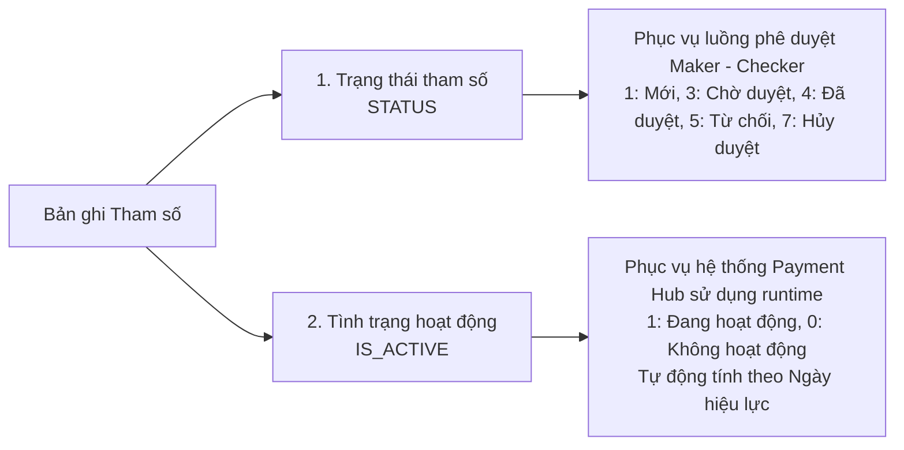
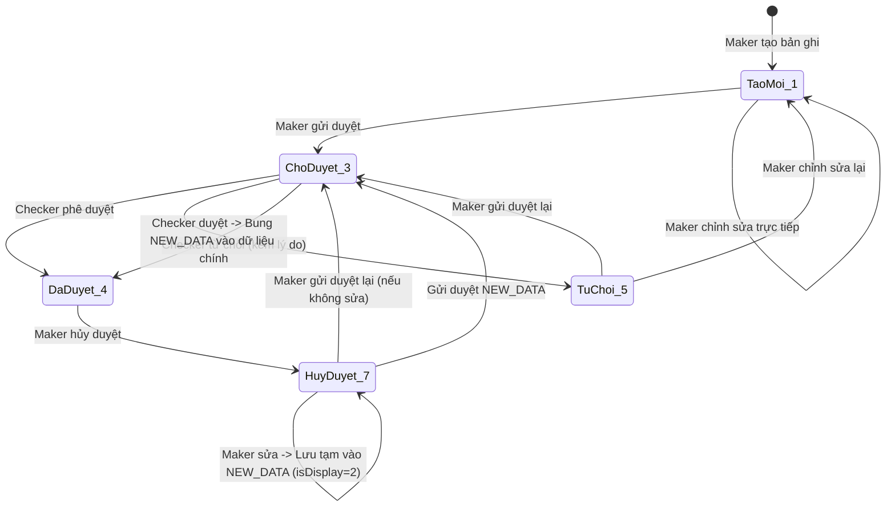
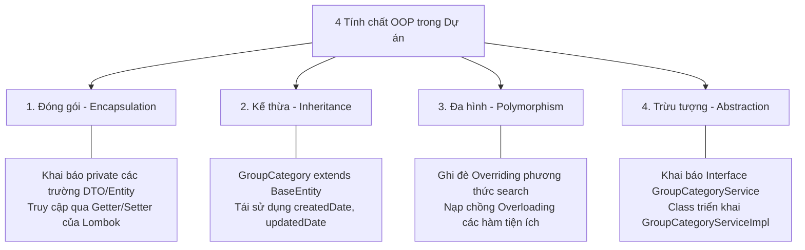
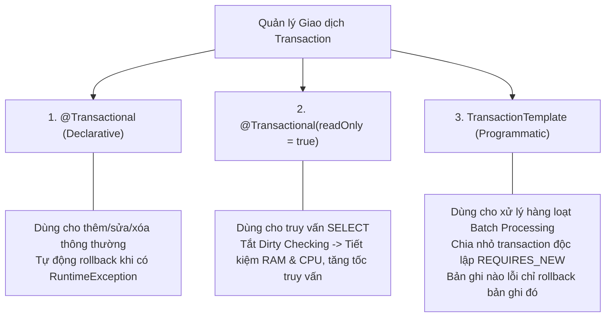
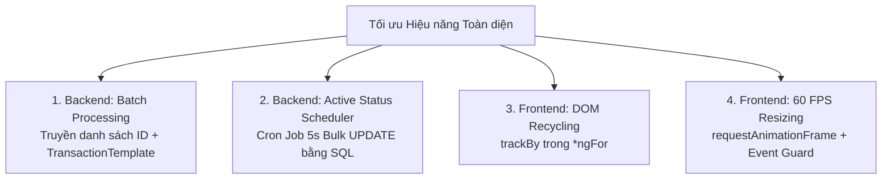

# Sổ Tay Kiến Trúc & Ôn Tập Toàn Diện Dự Án Payment Hub (Learn 08)

Tài liệu này là bản tổng hợp **đầy đủ và chi tiết nhất**, kết hợp toàn bộ kiến thức nghiệp vụ, bài học thực tế Backend (Spring Boot, JPA, Transaction, OOP), Frontend (Angular, Taiga UI, DOM Optimization) và các bài toán tối ưu hiệu năng trong hệ thống Payment Hub.

---

## MỤC I. QUY TẮC NGHIỆP VỤ & LUỒNG TRẠNG THÁI THAM SỐ

### 1. Hai hệ thống trạng thái độc lập trong Payment Hub

Trong hệ thống ngân hàng, một bản ghi tham số luôn có **2 loại trạng thái riêng biệt** phục vụ 2 mục đích hoàn toàn khác nhau:



*   **Trạng thái tham số (`STATUS`):** Phục vụ quy trình kiểm soát nội bộ và phân tách quyền lực (Segregation of Duties). 
    *   `1 - Tạo mới`: Maker vừa tạo, chưa gửi duyệt.
    *   `3 - Chờ duyệt`: Maker đã gửi lên cho Checker xem xét.
    *   `4 - Đã duyệt`: Checker đã phê duyệt, bản ghi có hiệu lực chính thức.
    *   `5 - Từ chối`: Checker từ chối kèm lý do phản hồi.
    *   `7 - Hủy duyệt`: Maker xin rút lại để chỉnh sửa hoặc dừng áp dụng.
*   **Tình trạng hoạt động (`IS_ACTIVE`):** Phục vụ động cơ xử lý giao dịch thanh toán của hệ thống.
    *   Được tính toán động tự động: `1 - Hoạt động` khi `Ngày hiện tại nằm trong khoảng [Ngày hiệu lực, Ngày hết hiệu lực]`.
    *   Ngược lại (chưa đến ngày hiệu lực hoặc đã quá hạn), hệ thống tự động đánh dấu là `0 - Không hoạt động`, kể cả bản ghi mới tạo.

---

### 2. Ma trận các trạng thái được phép chỉnh sửa
*   **Được phép sửa:** `1 - Tạo mới`, `5 - Từ chối`, `7 - Hủy duyệt`.
*   **Cấm sửa:** 
    *   `3 - Chờ duyệt`: Bản ghi đang trong hàng đợi của Checker, cấm can thiệp để tránh xung đột dữ liệu lúc duyệt.
    *   `4 - Đã duyệt`: Bản ghi đang chạy thật, cấm sửa trực tiếp. Muốn sửa, Maker bắt buộc phải thực hiện thao tác **Hủy duyệt (7)** trước.

---

### 3. RULE Nghiệp vụ cốt lõi: Bản ghi Đã duyệt (4) $\rightarrow$ Hủy duyệt (7) $\rightarrow$ Sửa
*   **Nguyên tắc vàng:** Khi sửa một bản ghi đã từng được duyệt, **giá trị sửa KHÔNG được thay thế trực tiếp vào các cột chính của bản ghi**.
*   **Cơ chế lưu trữ:** Dữ liệu mới được đóng gói dưới dạng chuỗi JSON và lưu tạm vào cột **`NEW_DATA`**, đồng thời gắn cờ `IS_DISPLAY = 2` (Đã từng duyệt).
*   **Mục đích:**
    1.  Bản ghi cũ vẫn giữ nguyên vẹn để hệ thống Payment Hub tiếp tục chạy thông suốt không bị gián đoạn.
    2.  Khi mở màn hình Chi tiết, hệ thống sẽ hiển thị **Form đối chiếu song song 2 cột (Dữ liệu cũ vs Dữ liệu mới)** để Checker so sánh từng trường xem Maker đã sửa những gì trước khi bấm Duyệt.
    3.  Khi Checker bấm **Duyệt**, hệ thống mới bung JSON từ `NEW_DATA` ghi đè chính thức vào các cột thật và xóa trắng `NEW_DATA`.

---

### 4. Sơ đồ State Machine toàn diện luồng xử lý trạng thái



---

## MỤC II. REVIEW KIẾN THỨC JAVA BACKEND & SPRING BOOT

### 1. Ý nghĩa Annotation & So sánh `@Controller` vs `@RestController`

| Đặc điểm | `@Controller` (Truyền thống) | `@RestController` (Hiện đại - REST API) |
| :--- | :--- | :--- |
| **Bản chất** | Dùng cho kiến trúc MVC truyền thống (Server-Side Rendering). | Là sự kết hợp của **`@Controller` + `@ResponseBody`**. |
| **Kết quả trả về** | Trả về **Tên View / Template** (file `.html`, `.jsp`) để ViewResolver render giao diện. | Trả về **Dữ liệu thô (Data)**: Tự động chuyển Java Object thành **JSON / XML**. |
| **Muốn trả JSON** | Bắt buộc phải gắn thêm `@ResponseBody` trên từng hàm. | Mặc định 100% mọi phương thức trong class đều tự động trả về JSON. |

---

### 2. Constructor trong Java & Dependency Injection
*   **Bản chất:** Constructor là phương thức đặc biệt cùng tên với Class, không có kiểu trả về, chạy duy nhất 1 lần khi gọi `new`.
*   **Từ khóa `this(...)` và `super(...)`:**
    *   `this(...)`: Gọi constructor khác của chính class hiện tại. Phải nằm ở dòng đầu tiên.
    *   `super(...)`: Gọi constructor của class cha (`Parent`). Phải nằm ở dòng đầu tiên của lớp con.
*   **Tại sao Constructor Injection là Best Practice trong Spring?**
    *   *Field Injection (`@Autowired` trên biến):* Làm class phụ thuộc chặt chẽ vào Spring Container, khó viết Unit Test (không mock được nếu không dùng reflection).
    *   *Constructor Injection (kết hợp `@RequiredArgsConstructor` của Lombok):* Đảm bảo biến có thể khai báo **`final`** (bất biến), kiểm tra thiếu sót phụ thuộc ngay lúc biên dịch, dễ dàng truyền Mock Object vào khi viết Unit Test.

---

### 3. Lập trình Hướng đối tượng (OOP) trong thực tế Payment Hub



---

### 4. Kiểu nguyên thủy (Primitive) vs Kiểu đối tượng Wrapper

| Tiêu chí so sánh | Kiểu nguyên thủy (Primitive: `int`, `long`, `boolean`) | Kiểu đối tượng Wrapper (`Integer`, `Long`, `Boolean`) |
| :--- | :--- | :--- |
| **Vùng nhớ** | Lưu trực tiếp giá trị trên **Stack** (Rất nhanh, tốn ít RAM). | Lưu con trỏ tham chiếu trên **Stack**, dữ liệu thật lưu trên **Heap**. |
| **Giá trị mặc định** | `0` (với số), `false` (với boolean). **Không thể mang giá trị `null`**. | **`null`** (khi chưa được gán). |
| **Khả năng dùng Collection** | Không dùng được trong Generic: `List<int>` $\rightarrow$ Báo lỗi! | Dùng hoàn hảo: `List<Integer>`, `Optional<Long>`. |

#### 👉 Tại sao trong Entity & DTO của Database BẮT BUỘC dùng Wrapper (`Integer`, `Long`)?
1.  **Phản ánh đúng bản chất Database:** Một cột trong DB nếu chưa nhập giá trị thì mang giá trị `NULL`. Nếu dùng kiểu `int`, khi đọc từ DB lên nó sẽ tự ép thành `0`, gây sai lệch hoàn toàn dữ liệu nghiệp vụ (ví dụ: `STATUS = null` bị biến thành `STATUS = 0`).
2.  **Hỗ trợ tìm kiếm động (Search Filter):** Khi người dùng không lọc theo trạng thái, trường `status` gửi lên là `null`. Nếu dùng `Integer status`, ta dễ dàng kiểm tra `if (status != null)` để thêm điều kiện query. Nếu dùng `int`, nó luôn mặc định là `0` và gây lọc sai dữ liệu.

---

### 5. Vòng đời của Annotation (Retention Policy) & Reflection
Mỗi Annotation trong Java có một thời gian sống được chỉ định bằng `@Retention`:
1.  **`RetentionPolicy.SOURCE`:** Chỉ tồn tại trong mã nguồn `.java`, bị trình biên dịch xóa bỏ khi tạo file `.class` (Ví dụ: `@Override`, các annotation của Lombok như `@Getter`, `@Setter`).
2.  **`RetentionPolicy.CLASS`:** Được lưu vào file `.class` nhưng máy ảo JVM không nạp lên bộ nhớ lúc chạy (Mặc định).
3.  **`RetentionPolicy.RUNTIME`:** Được nạp vào bộ nhớ JVM khi ứng dụng chạy. Spring Boot sử dụng cơ chế **Java Reflection** để quét và đọc các annotation này lúc khởi động nhằm tự động khởi tạo Bean (`@Service`, `@Repository`, `@Transactional`, `@RestController`).

---

### 6. Đối tượng `ObjectMapper` (Jackson) & Xử lý JSON
`ObjectMapper` là công cụ trung tâm của thư viện Jackson dùng để chuyển đổi qua lại giữa Java Object và chuỗi JSON:
*   **Object $\rightarrow$ JSON String (Serialization):**
    ```java
    GroupCategoryDTO dto = ...;
    String jsonString = objectMapper.writeValueAsString(dto); // Lưu vào cột NEW_DATA
    ```
*   **JSON String $\rightarrow$ Object (Deserialization):**
    ```java
    String json = entity.getNewData();
    GroupCategoryDTO dto = objectMapper.readValue(json, GroupCategoryDTO.class);
    ```

---

### 7. Cơ chế Transaction & Khả năng Rollback khi có lỗi
Transaction đảm bảo trọn vẹn 4 tính chất **ACID**:
*   **A (Atomicity - Tính nguyên tử):** Tất cả cùng thành công, hoặc tất cả cùng thất bại.
*   **C (Consistency - Tính nhất quán):** Dữ liệu luôn đúng theo mọi ràng buộc toàn vẹn.
*   **I (Isolation - Tính cô lập):** Các transaction chạy đồng thời không can thiệp lẫn nhau.
*   **D (Durability - Tính bền vững):** Dữ liệu sau khi commit sẽ tồn tại vĩnh viễn dù sập nguồn.

#### Vì sao DB có thể Rollback?
Khi mở Transaction, Database ghi nhận mọi thay đổi vào **Undo Log / WAL (Write-Ahead Logging)** trong bộ nhớ đệm trước. Nếu có Exception xảy ra, Spring gửi lệnh `ROLLBACK` $\rightarrow$ Database dùng Undo Log khôi phục lại trạng thái dữ liệu y như ban đầu.

---

### 8. `@Transactional` trên phương thức `private` có tác dụng không?
👉 **Trả lời: KHÔNG CÓ TÁC DỤNG!**
*   **Nguyên nhân:** Spring quản lý Transaction bằng cơ chế **Spring AOP Proxy (Dynamic Proxy / CGLIB)**. Spring tạo ra một lớp vỏ bọc (Proxy) bao quanh Bean của bạn để chặn các lời gọi hàm từ bên ngoài vào, mở Transaction trước khi chạy hàm và Commit sau khi hàm kết thúc.
*   Vì phương thức `private` không thể được kế thừa hay gọi từ bên ngoài Proxy, Spring Proxy **không thể can thiệp được**.
*   **Vấn đề Self-invocation (Tự gọi hàm nội bộ):** Nếu phương thức `public A()` gọi `public B()` (có `@Transactional`) trong cùng 1 Class, Transaction của `B()` cũng sẽ **không hoạt động** vì nó đi tắt qua con trỏ `this`, không đi qua Proxy của Spring.

---

### 9. Mối liên hệ giữa Entity JPA, Persistence Context và `@Transactional`

```mermaid
graph LR
    subgraph Spring Boot Application
        A[Entity: Transient] -- persist / query --> B[Persistence Context<br/>Managed State]
        B -- "Thay đổi thuộc tính (Setter)" --> C[Dirty State]
    end
    
    subgraph Transaction Lifecycle
        C -- "Commit Transaction" --> D[Hibernate so sánh Snapshot<br/>(Dirty Checking)]
        D -- "Tự động sinh SQL UPDATE" --> E[(Database: Oracle)]
    end
```

---

### 10. Phân tích đoạn code của anh Trường (Dirty Checking Kinh Điển)

```java
@Transactional
public void updateTestTransactionsl() {
    ProcessingComponent comp = this.repository.findById(String.valueOf(304)).orElseThrow(
            () -> new RuntimeException("Không tìm thấy"));
    comp.setStatus(1);
    // 👉 HOÀN TOÀN KHÔNG CÓ LỆNH repository.save(comp);
}
```

1.  **Tại sao không gọi `repository.save()` mà DB vẫn tự động `UPDATE`?**
    *   Nhờ có `@Transactional`, đối tượng `comp` sau `findById` nằm ở trạng thái **Managed** trong Persistence Context. Hibernate đã lưu 1 bản snapshot ban đầu.
    *   Khi bạn gọi `comp.setStatus(1)`, Hibernate phát hiện có sự thay đổi giữa entity và snapshot (**Dirty Checking**).
    *   Trước khi đóng Transaction, Hibernate **tự động sinh câu lệnh SQL `UPDATE PMH_COMPONENTS SET STATUS = 1 WHERE ID = 304;` và bắn xuống Database**.
2.  **Nếu có Exception văng ra giữa chừng?**
    *   Spring bắt được Exception $\rightarrow$ Ra lệnh cho Database **`ROLLBACK`** $\rightarrow$ Quá trình lưu bị hủy bỏ 100%, trường `STATUS` trong DB giữ nguyên giá trị cũ.

---

### 11. So sánh `@Transactional`, `@Transactional(readOnly = true)` và `TransactionTemplate`



---

### 12. Chuẩn hóa mã phản hồi HTTP Status Code (RESTful Standard)
*   **`200 OK`:** Lấy dữ liệu thành công, cập nhật hoặc xóa thành công.
*   **`201 Created`:** Thêm mới bản ghi thành công.
*   **`400 Bad Request`:** Dữ liệu Client gửi lên vi phạm quy tắc validation (Validation Error).
*   **`401 Unauthorized`:** Chưa xác thực danh tính (chưa đăng nhập / thiếu token).
*   **`403 Forbidden`:** Bị từ chối truy cập do phân quyền (Ví dụ: Maker tự duyệt bản ghi của chính mình).
*   **`404 Not Found`:** Bản ghi cần tìm không tồn tại trong hệ thống.
*   **`500 Internal Server Error`:** Lỗi sập hệ thống hoặc lỗi cơ sở dữ liệu chưa được xử lý.

---

## MỤC III. REVIEW KIẾN THỨC ANGULAR FRONTEND

### 1. Toán tử Logical OR (`||`) vs Nullish Coalescing (`??`)
*   **Toán tử `||`:** Kiểm tra giá trị **Falsy** (`false`, `0`, `""`, `null`, `undefined`, `NaN`). Nếu giá trị là `0` hoặc chuỗi rỗng `""`, nó sẽ vô tình đè giá trị mặc định lên.
*   **Toán tử `??`:** Chỉ kiểm tra giá trị **Nullish** (`null` hoặc `undefined`). Giúp bảo toàn chính xác giá trị số `0` hoặc chuỗi rỗng `""`.

```typescript
const name1 = person.name || 'Nguyễn Tiến Đạt'; // Nếu name là "" -> biến thành 'Nguyễn Tiến Đạt' (Mất chuỗi rỗng)
const name2 = person.name ?? 'Nguyễn Tiến Đạt'; // Nếu name là "" -> giữ nguyên "" (Chỉ null/undefined mới lấy mặc định)
```

---

### 2. Truyền dữ liệu `@Input()` và `@Output()` trong Angular
*   **`@Input()` (Cha $\rightarrow$ Con):** Mở cổng nhận dữ liệu từ Component cha truyền xuống.
    *   *Thực tế trong dự án:* `CategoryDetailComponent` (Cha) truyền `[rows]="oldDataRows"` xuống Component con `app-comparison-card` để hiển thị cột đối chiếu.
*   **`@Output()` (Con $\rightarrow$ Cha):** Component con phát tín hiệu sự kiện (`EventEmitter.emit()`) để Component cha lắng nghe và xử lý.

---

### 3. Vòng đời Component & Thời điểm khởi chạy `ngOnInit()`
Thứ tự thực thi khi Angular khởi tạo Component:
1.  **`constructor()`:** Được gọi đầu tiên bởi JavaScript runtime để cấp phát ô nhớ và tiêm Dependency (`inject`). Lúc này các thuộc tính nhận từ cha `@Input()` **chưa có dữ liệu** (vẫn là `undefined`).
2.  **`ngOnChanges()`:** Chạy khi các thuộc tính `@Input()` nhận dữ liệu lần đầu tiên.
3.  **`ngOnInit()`:** Khởi tạo logic chính của Component. Tất cả `@Input()` đã sẵn sàng. **Đây là thời điểm chuẩn nhất để gọi API tải dữ liệu ban đầu**.
4.  **`ngAfterViewInit()`:** Giao diện HTML và các thẻ DOM con đã được vẽ xong hoàn toàn lên màn hình.
5.  **`ngOnDestroy()`:** Chạy ngay trước khi Component bị hủy (khi chuyển trang), dùng để hủy `subscription`, dọn dẹp bộ nhớ chống rò rỉ RAM (Memory Leak).

---

### 4. Cơ chế Tiêm phụ thuộc qua hàm `inject()`
*   `inject(LanguageService)` là cơ chế tiêm hiện đại từ Angular 14+.
*   **Ưu điểm:** Khai báo trực tiếp trên thuộc tính mà không cần khai báo danh sách dài dòng trong Constructor, đặc biệt khi kế thừa Class cha (`extends BaseComponent`) không phải gọi `super(dep1, dep2, dep3)`.
*   **Quy tắc:** Chỉ được gọi trong **Injection Context** (lúc khởi tạo thuộc tính của Class hoặc trong Constructor).

---

## MỤC IV. BÀI TOÁN TẬP TRUNG HIỆU NĂNG CAO TRONG THỰC TẾ



### 1. Phê duyệt / Hủy duyệt hàng loạt bằng Danh sách ID (Batch Processing)
*   **Vấn đề:** Thay vì gửi từng đối tượng lớn lên server nhiều lần gây nghẽn mạng, Frontend chỉ gửi một danh sách mã: `List<Long> ids` hoặc `List<String> codes`.
*   **Giải pháp Backend:** Sử dụng `TransactionTemplate` với `PROPAGATION_REQUIRES_NEW` để xử lý từng bản ghi trong vòng lặp độc lập. Bản ghi nào thành công thì Commit ngay, bản ghi nào lỗi phân quyền thì Rollback riêng bản ghi đó và trả về báo cáo tổng kết chi tiết `success=9/10`.

---

### 2. Tự động hóa cập nhật `isActive` bằng Scheduler Cron Job 5s
*   **Yêu cầu:** Trạng thái hoạt động phải luôn chính xác theo từng giây dựa vào `effectiveDate` và `endEffectiveDate` mà không cần người dùng tải lại trang.
*   **Giải pháp:** 
    1.  Tạo [ActiveStatusScheduler.java](file:///e:/PMH/code/backend/src/main/java/com/example/paymenthub/scheduler/ActiveStatusScheduler.java) với `@Scheduled(fixedRate = 5000)`.
    2.  Thực thi câu lệnh SQL Bulk Update trực tiếp trên Database để cập nhật đồng loạt hàng ngàn bản ghi chỉ trong vài mili-giây mà không làm tăng tải RAM:
        ```sql
        UPDATE PMH_GROUP_CATEGORY 
        SET IS_ACTIVE = CASE 
            WHEN EFFECTIVE_DATE <= CURRENT_TIMESTAMP AND (END_EFFECTIVE_DATE IS NULL OR CURRENT_TIMESTAMP <= END_EFFECTIVE_DATE) THEN 1 
            ELSE 0 
        END;
        ```

---

### 3. Tối ưu hóa DOM Rendering trên Angular bằng `trackBy`
*   **Cơ chế:** Khi bảng danh sách được làm mới (do phân trang, tìm kiếm, hoặc Scheduler 5s cập nhật trạng thái), mặc định Angular sẽ xóa toàn bộ các thẻ `<tr>`, `<td>` và vẽ lại từ đầu gây chớp nháy màn hình và tốn CPU.
*   **Giải pháp:** Gắn hàm `trackBy` theo khóa chính duy nhất:
    *   Danh mục: `trackById(index, item) { return item.id; }`
    *   Cấu phần: `trackByCode(index, item) { return item.componentCode; }`
    *   Cột: `trackByColId(index, col) { return col.id; }`
*   **Kết quả:** Angular giữ nguyên các DOM Node cũ trên màn hình, chỉ cập nhật đúng ô có dữ liệu thay đổi $\rightarrow$ Giao diện mượt mà tuyệt đối!

---

### 4. Tách biệt triệt để Kéo giãn cột (Resize 60 FPS) và Sắp xếp (3-State Sort)
*   **Đồng bộ khung hình:** Áp dụng `requestAnimationFrame` trong sự kiện `mousemove` giúp thao tác kéo giãn cột đạt tốc độ khung hình tối đa 60 FPS.
*   **Chống kích hoạt nhầm Sort:**
    1.  Khóa nổi bọt sự kiện `(click)="$event.stopPropagation()"` trên thẻ `.resize-handle`.
    2.  Bổ sung cờ `justResized` kèm thời gian chờ 150ms để ngăn chặn hoàn toàn việc trình duyệt tự động kích hoạt hàm sắp xếp khi người dùng vừa nhả chuột sau khi kéo dãn.
*   **Bộ Icon Taiga UI 3 trạng thái:** Tích hợp trực tiếp `<tui-icon>` (`@tui.chevron-up`, `@tui.chevron-down`, `@tui.chevrons-up-down`) chuẩn thiết kế ngân hàng cao cấp.
