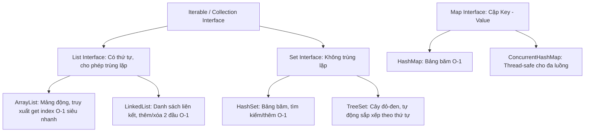

# BÀI HỌC 09: CẨM NANG JAVA NÂNG CAO & SPRING BOOT THỰC CHIẾN CHUYÊN SÂU

> **Mục tiêu:** Tổng hợp toàn diện 7 chủ đề Java & Spring Boot nâng cao cốt lõi được ứng dụng thực tế trong hệ thống Ngân hàng **Payment Hub**. Tài liệu đóng vai trò là cẩm nang chuyên sâu phục vụ làm chủ dự án, review code và phỏng vấn kiến trúc phần mềm.

---

## MỤC LỤC
1. [Java Stream API & Lambda Expression (Lập trình hàm)](#1-java-stream-api--lambda-expression)
2. [`Optional<T>` & Kỹ thuật diệt tận gốc lỗi `NullPointerException`](#2-optionalt--kỹ-thuật-diệt-tận-gốc-lỗi-nullpointerexception)
3. [Dependency Injection (DI), IoC & Vòng đời của Spring Bean](#3-dependency-injection-di-ioc--vòng-đời-của-spring-bean)
4. [Java Collections Framework & Quy tắc Vàng `equals()` / `hashCode()`](#4-java-collections-framework--quy-tắc-vàng-equals--hashcode)
5. [Design Pattern: Builder Pattern & Cơ chế sinh mã Lombok](#5-design-pattern-builder-pattern--cơ-chế-sinh-mã-lombok)
6. [Xử lý Ngày Giờ Chuẩn Java 8+ (`java.time.*`)](#6-xử-lý-ngày-giờ-chuẩn-java-8-javatime)
7. [JPA Criteria API & Dynamic Specification (Truy vấn động an toàn)](#7-jpa-criteria-api--dynamic-specification-truy-vấn-động-an-toàn)

---

## 1. Java Stream API & Lambda Expression

Từ Java 8, **Stream API** và **Lambda Expression** mang phong cách lập trình hàm (Functional Programming) vào Java, giúp xử lý tập hợp dữ liệu (Collections) một cách ngắn gọn, tường minh và tối ưu hiệu năng.

```mermaid
graph LR
    DataSource[Nguồn dữ liệu<br/>List, Set...] --> Stream[Khởi tạo Stream<br/>.stream()]
    Stream --> Inter1[Trung gian 1<br/>.filter()]
    Inter1 --> Inter2[Trung gian 2<br/>.map()]
    Inter2 --> Terminal[Đầu cuối (Chốt)<br/>.collect() / .count() / .toList()]
```

### 1.1. Cú pháp Lambda & Method Reference
*   **Lambda Expression:** `(tham_số) -> { thân_hàm }`
    ```java
    // Cách cũ (Anonymous Class):
    results.stream().filter(new Predicate<Map<String, Object>>() {
        @Override
        public boolean test(Map<String, Object> r) {
            return Boolean.TRUE.equals(r.get("success"));
        }
    });

    // Cách mới (Lambda):
    results.stream().filter(r -> Boolean.TRUE.equals(r.get("success")));
    ```
*   **Method Reference (`::`):** Tham chiếu trực tiếp đến phương thức có sẵn.
    ```java
    // Dạng Lambda:
    result.map(entity -> GroupCategoryResponseDTO.fromEntity(entity));

    // Dạng Method Reference rút gọn:
    result.map(GroupCategoryResponseDTO::fromEntity);
    ```

### 1.2. Các thao tác Stream cốt lõi trong Dự án:

| Thao tác Stream | Phân loại | Ý nghĩa | Ví dụ trong Payment Hub |
| :--- | :---: | :--- | :--- |
| **`.filter(Predicate)`** | Trung gian | Lọc các phần tử thỏa mãn điều kiện logic. | `results.stream().filter(r -> Boolean.TRUE.equals(r.get("success")))` |
| **`.map(Function)`** | Trung gian | Biến đổi từ đối tượng kiểu này sang kiểu khác (Entity $\rightarrow$ DTO). | `categories.stream().map(GroupCategoryResponseDTO::fromEntity)` |
| **`.collect(Collectors.toList())`** | Đầu cuối | Đóng gói các phần tử trong Stream trở lại thành `List`. | `.collect(Collectors.toList())` |
| **`.count()`** | Đầu cuối | Đếm tổng số lượng phần tử thỏa mãn. | `.filter(...).count()` |
| **`.findFirst()`** | Đầu cuối | Lấy ra phần tử đầu tiên tìm thấy (trả về `Optional<T>`). | `list.stream().filter(...).findFirst()` |

---

## 2. `Optional<T>` & Kỹ thuật diệt tận gốc lỗi `NullPointerException`

`NullPointerException (NPE)` là nguyên nhân hàng đầu làm sập ứng dụng Java ("The Billion Dollar Mistake"). `Optional<T>` được tạo ra như một chiếc "hộp chứa", bên trong có thể chứa một giá trị hoặc rỗng (`null`).

```mermaid
graph TD
    Query[repository.findById(id)] --> Opt[Optional Hộp chứa]
    Opt -- Có bản ghi --> Present[Chứa Entity]
    Opt -- Không tìm thấy --> Empty[Optional.empty Hộp rỗng]
    
    Present & Empty --> Handle[Xử lý an toàn:]
    Handle --> H1[.orElseThrow: Bắn Exception chuẩn 404]
    Handle --> H2[.ifPresent: Thực thi nếu có]
    Handle --> H3[.orElse: Trả về giá trị mặc định]
```

### 2.1. So sánh: Viết kiểu cũ vs Dùng `Optional` chuẩn Spring Boot

```java
// ❌ CÁCH CŨ (Dễ dính NPE nếu quên check null):
GroupCategory entity = repository.findByIdOld(id);
if (entity == null) {
    throw new ResourceNotFoundException("Không tìm thấy!");
}
return entity;

// ✅ CÁCH CHUẨN TRONG PAYMENT HUB (Dùng Optional + Lambda 1 dòng):
return repository.findById(id)
        .orElseThrow(() -> new ResourceNotFoundException("Không tìm thấy tham số với ID: " + id));
```

### 2.2. Bảng phương thức `Optional` thực chiến:

| Phương thức | Ý nghĩa & Ứng dụng |
| :--- | :--- |
| **`.orElseThrow(Supplier)`** | Nếu có giá trị thì trả về; nếu rỗng thì ném ngoại lệ (`ResourceNotFoundException`). |
| **`.orElse(defaultValue)`** | Nếu rỗng thì gán giá trị mặc định thay thế. |
| **`.ifPresent(Consumer)`** | Chỉ thực thi đoạn code nếu bên trong có dữ liệu (không cần viết `if != null`). |
| **`.map(Function)`** | Biến đổi dữ liệu bên trong hộp nếu tồn tại: `optEntity.map(GroupCategory::getParamName)`. |

---

## 3. Dependency Injection (DI), IoC & Vòng đời của Spring Bean

### 3.1. Ba cách tiêm phụ thuộc (Dependency Injection)

```java
// ❌ CÁCH 1: Field Injection (Dùng @Autowired trực tiếp trên biến)
// Nhược điểm: Khó viết Unit Test, không thể khai báo final, dễ bị lỗi vòng lặp (Circular Dependency).
@Autowired
private GroupCategoryRepository repository;

// ❌ CÁCH 2: Setter Injection
// Nhược điểm: Đối tượng có thể bị thay đổi phụ thuộc sau khi đã khởi tạo.
@Autowired
public void setRepository(GroupCategoryRepository repository) { this.repository = repository; }

// ✅ CÁCH 3: Constructor Injection (CHUẨN SỐ 1 - Dự án Payment Hub đang dùng)
// Ưu điểm: Khai báo được biến 'final' (Bất biến/Thread-safe), dễ dàng Mock khi viết Unit Test.
private final GroupCategoryRepository repository;
private final ObjectMapper objectMapper;

public GroupCategoryServiceImpl(GroupCategoryRepository repository, ObjectMapper objectMapper) {
    this.repository = repository;
    this.objectMapper = objectMapper;
}
```

### 3.2. Scope của Spring Bean (Phạm vi tồn tại)

| Bean Scope | Số lượng trong RAM | Ứng dụng thực tế |
| :--- | :---: | :--- |
| **`Singleton` (Mặc định)** | **Duy nhất 1 instance** trong suốt vòng đời của ứng dụng. | Dùng cho 99% các tầng `@Service`, `@Repository`, `@RestController`, `@Component` vì chúng chỉ chứa logic xử lý, không lưu trạng thái riêng của người dùng. |
| **`Prototype`** | **Tạo mới 1 instance** mỗi khi có lời gọi tiêm Bean. | Dùng cho các đối tượng Stateful (chứa trạng thái riêng cho từng tác vụ độc lập). |
| **`Request` / `Session`** | Tạo mới theo từng HTTP Request / Session đăng nhập. | Dùng lưu giỏ hàng, thông tin phiên đăng nhập của người dùng. |

---

## 4. Java Collections Framework & Quy tắc Vàng `equals()` / `hashCode()`



### 4.1. Hợp đồng bắt buộc: `equals()` và `hashCode()` Contract
Khi bạn đưa một đối tượng Java vào làm Key của `HashMap` hoặc phần tử của `HashSet`:
1.  **Bước 1:** `HashSet`/`HashMap` gọi hàm **`hashCode()`** để tính ra chỉ số thùng chứa (Bucket Index) trong bộ nhớ.
2.  **Bước 2:** Nếu trong thùng có nhiều đối tượng bị trùng mã băm (Hash Collision), nó mới gọi tiếp hàm **`equals()`** để kiểm tra chính xác 2 đối tượng có bằng nhau không.

👉 **Quy tắc vàng:**
*   Nếu $obj1.\text{equals}(obj2) == \text{true}$ thì **BẮT BUỘC** $obj1.\text{hashCode}() == obj2.\text{hashCode}()$.
*   Nếu bạn chỉ Override `equals()` mà quên Override `hashCode()`, `HashSet` và `HashMap` sẽ bị lỗi: Hai đối tượng có cùng dữ liệu nhưng lại bị lưu thành 2 phần tử khác nhau!

---

## 5. Design Pattern: Builder Pattern & Cơ chế sinh mã Lombok

### 5.1. Vấn đề "Constructor xếp tầng" (Telescoping Constructor Anti-pattern)
Giả sử một Class có 10 trường:
```java
// ❌ Cách cổ điển: Phải tạo hàng loạt Constructor với đủ loại tham số
public ApiResponse(boolean success, String message) { ... }
public ApiResponse(boolean success, String message, T data) { ... }
public ApiResponse(boolean success, String message, T data, LocalDateTime timestamp) { ... }

// Khi gọi rất dễ nhầm lẫn vị trí tham số:
ApiResponse res = new ApiResponse(true, "Thành công", null, LocalDateTime.now());
```

### 5.2. Giải pháp Builder Pattern với Lombok `@Builder`
Trong [ApiResponse.java](file:///e:/PMH/code/backend/src/main/java/com/example/paymenthub/common/base/ApiResponse.java):
```java
@Getter
@Setter
@Builder // 👉 Lombok tự động sinh ra Builder Pattern lúc biên dịch
@AllArgsConstructor
@NoArgsConstructor
public class ApiResponse<T> {
    private boolean success;
    private String message;
    private T data;
    private LocalDateTime timestamp;
}

// 👉 Sử dụng Fluent API rõ ràng, không bao giờ nhầm lẫn thứ tự:
ApiResponse<GroupCategoryResponseDTO> response = ApiResponse.<GroupCategoryResponseDTO>builder()
        .success(true)
        .message("Tạo mới thành công")
        .data(dtoResult)
        .timestamp(LocalDateTime.now())
        .build();
```

---

## 6. Xử lý Ngày Giờ Chuẩn Java 8+ (`java.time.*`)

### 6.1. Vì sao Java 8 khai tử `java.util.Date` và `java.util.Calendar`?
1.  **Lỗi Không an toàn đa luồng (Not Thread-Safe):** `Date` có thể bị sửa đổi giá trị (`mutable`), gây sai lệch dữ liệu khi nhiều luồng cùng truy cập.
2.  **Thiết kế bất hợp lý:** Tháng trong `Date` chạy từ `0` đến `11` (Tháng 1 là 0), gây nhầm lẫn trầm trọng.
3.  **Không phân biệt rõ ràng:** `Date` chứa cả ngày, giờ lẫn múi giờ nhưng không tường minh.

### 6.2. Các lớp Ngày Giờ hiện đại trong Java 8+:

```
┌─────────────────────────┬───────────────────────────────────┬──────────────────────────────────────┐
│ Kiểu dữ liệu            │ Ý nghĩa                           │ Áp dụng trong Dự án Payment Hub      │
├─────────────────────────┼───────────────────────────────────┼──────────────────────────────────────┤
│ 📅 LocalDate            │ Chỉ có Ngày (yyyy-MM-dd)          │ Ngày sinh, ngày lễ ngân hàng         │
│ 🕒 LocalTime            │ Chỉ có Giờ (HH:mm:ss)             │ Giờ mở/đóng cửa giao dịch            │
│ 📆 LocalDateTime        │ Ngày + Giờ (Không kèm Múi giờ)    │ EFFECTIVE_DATE, END_EFFECTIVE_DATE   │
│ ⏱️ Instant              │ Mốc thời gian tuyệt đối (UTC/GMT) │ Ghi Timestamp chuẩn trong Audit Log  │
│ 🌐 ZonedDateTime        │ Ngày + Giờ + Múi giờ (GMT+7)      │ Giao dịch thanh toán quốc tế SWIFT   │
└─────────────────────────┴───────────────────────────────────┴──────────────────────────────────────┘
```

---

## 7. JPA Criteria API & Dynamic Specification (Truy vấn động an toàn)

Trong [GroupCategorySpecification.java](file:///e:/PMH/code/backend/src/main/java/com/example/paymenthub/repository/specification/GroupCategorySpecification.java), thay vì ghép chuỗi SQL thủ công (dễ bị tấn công SQL Injection), dự án sử dụng **JPA Specification**:

```java
public class GroupCategorySpecification {

    public static Specification<GroupCategory> filter(
            String paramType, String paramValue, String paramName,
            List<Integer> status, List<Integer> isActive) {

        return (Root<GroupCategory> root, CriteriaQuery<?> query, CriteriaBuilder cb) -> {
            List<Predicate> predicates = new ArrayList<>();

            // 1. Lọc theo paramType (So khớp chính xác):
            if (paramType != null && !paramType.trim().isEmpty()) {
                predicates.add(cb.equal(root.get("paramType"), paramType.trim()));
            }

            // 2. Lọc theo paramName (Tìm kiếm gần đúng LIKE không phân biệt hoa thường):
            if (paramName != null && !paramName.trim().isEmpty()) {
                predicates.add(cb.like(cb.lower(root.get("paramName")), "%" + paramName.trim().toLowerCase() + "%"));
            }

            // 3. Lọc theo danh sách trạng thái (IN clause):
            if (status != null && !status.isEmpty()) {
                predicates.add(root.get("status").in(status));
            }

            // Kết hợp toàn bộ điều kiện bằng toán tử AND:
            return cb.and(predicates.toArray(new Predicate[0]));
        };
    }
}
```

### 3 Thành phần then chốt của Criteria API:
*   **`Root<T>`:** Đại diện cho Bảng dữ liệu chính (tương đương `FROM PMH_GROUP_CATEGORY`). Dùng để trỏ đến các cột (`root.get("paramName")`).
*   **`CriteriaBuilder (cb)`:** Nhà máy chế tạo các phép toán logic (`cb.equal`, `cb.like`, `cb.greaterThanOrEqualTo`, `cb.and`, `cb.or`).
*   **`CriteriaQuery<?>`:** Đại diện cho toàn bộ câu lệnh truy vấn tổng thể.

---

## 🎯 TỔNG KẾT BỘ 9 BÀI HỌC KIẾN THỨC

| Bài học | Chủ đề chính |
| :--- | :--- |
| **Learn 01 - 02** | Cơ sở dữ liệu Oracle, Stored Procedures, RefCursor, Chuẩn hóa API Response. |
| **Learn 03 - 04** | Xử lý Ngoại lệ Tập trung (`GlobalExceptionHandler`), Bean Validation, JPA Repository vs Native SQL. |
| **Learn 05 - 06** | Phân trang & Sắp xếp ổn định (Stable Pagination), Tổng quan Kiến trúc Hệ thống Payment Hub. |
| **Learn 07 - 08** | Bảo mật Maker - Checker, Quy tắc `NEW_DATA`, `@Transactional` & Dirty Checking, Chuẩn hóa Enum. |
| **Learn 09** | **Java Stream API, Optional, Dependency Injection, Collections Contract, Builder Pattern, Time API, JPA Specification.** |
