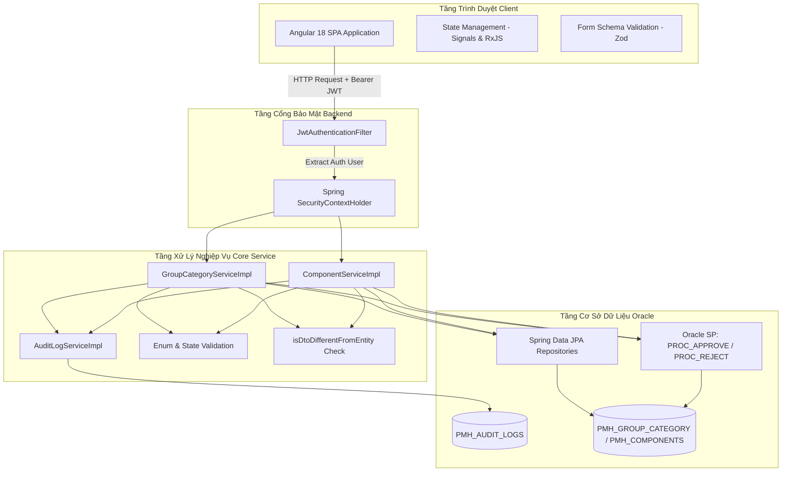

# BÀI HỌC 10: BÁO CÁO TOÀN DIỆN REVIEW TOÀN BỘ MÃ NGUỒN VÀ KIẾN TRÚC HỆ THỐNG NGÂN HÀNG PAYMENT HUB

> **Tác giả:** Senior Banking Enterprise Software Architect (20 năm kinh nghiệm trong Hệ thống Thanh toán & Core Banking)  
> **Dự án:** Payment Hub (Hệ thống Quản lý Cấu hình & Tham số Thanh toán Ngân hàng)  
> **Phạm vi Audit:** Đọc tỉ mỉ từng file, từng dòng code của toàn bộ 56 file Backend Java Spring Boot và toàn bộ 35+ file Frontend Angular 18 / Taiga UI.

---

## MỤC LỤC

1. [Lời Mở Đầu & Góc Nhìn Kiến Trúc Ngân Hàng 20 Năm Kinh Nghiệm](#1-lời-mở-đầu--góc-nhìn-kiến-trúc-ngân-hàng-20-năm-kinh-nghiệm)
2. [Sơ Đồ Kiến Trúc & Luồng Dữ Liệu Tổng Thể Hệ Thống Payment Hub](#2-sơ-đồ-kiến-trúc--luồng-dữ-liệu-tổng-thể-hệ-thống-payment-hub)
3. [Phân Tích Chi Tiết Từng File Code Tầng Backend (Java Spring Boot)](#3-phân-tích-chi-tiết-từng-file-code-tầng-backend-java-spring-boot)
   - 3.1. Gói Bảo mật (`security` package)
   - 3.2. Gói Điều khiển (`controller` package)
   - 3.3. Gói Xử lý Nghiệp vụ (`service` & `service.impl` packages)
   - 3.4. Gói Thực thể & Thực thể cơ sở (`entity` & `base` packages)
   - 3.5. Gói Mã chuẩn hóa Enum (`common.enums` package)
   - 3.6. Gói DTO, Response & Mapper (`dto`, `mapper` packages)
   - 3.7. Gói Truy vấn Cơ sở dữ liệu (`repository` & `specification` packages)
   - 3.8. Gói Xử lý Ngoại lệ & Tiện ích (`exception`, `config`, `util` packages)
4. [Phân Tích Chi Tiết Từng File Code Tầng Frontend (Angular 18 / Taiga UI)](#4-phân-tích-chi-tiết-từng-file-code-tầng-frontend-angular-18--taiga-ui)
   - 4.1. Tầng Core Services & Interceptors (`core` package)
   - 4.2. Tầng Feature Modules (Category & Processing Component Features)
   - 4.3. Tầng Validation Schemas & Zod Forms (`shared.validators`)
   - 4.4. Tầng Layout & Shared UI Components (`layout`, `shared.components`)
5. [Đánh Giá Các Quy Tắc Nghiệp Vụ Lõi Ngân Hàng (Core Banking Audit)](#5-đánh-giá-các-quy-tắc-nghiệp-vụ-lõi-ngân-hàng-core-banking-audit)
   - 5.1. Luồng Phê duyệt 2 Bước Maker - Checker & Nguyên tắc 4 Mắt
   - 5.2. Máy Trạng thái Lưu nháp qua Cột `NEW_DATA`
   - 5.3. Bảo toàn Dữ liệu Lịch sử & Quy tắc Phân định `isDisplay`
   - 5.4. Chặn Gửi Duyệt Khống Không Có Thay Đổi (`isDtoDifferentFromEntity` & `hasFormChanged`)
   - 5.5. Kiểm tra Ngày Hiệu lực & Chống Trùng lấn Thời gian
6. [Bảng Ma Trận Tổng Hợp Lỗi & Biện Pháp Khắc Phục Lỗi Mã Nguồn](#6-bảng-ma-trận-tổng-hợp-lỗi--biện-pháp-khắc-phục-lỗi-mã-nguồn)
7. [Hướng Dẫn Bảo Trì & Mở Rộng Hệ Thống Cho 100+ Module Tương Lai](#7-hướng-dẫn-bảo-trì--mở-rộng-hệ-thống-cho-100-module-tương-lai)

---

## 1. LỜI MỞ ĐẦU & GÓC NHÌN KIẾN TRÚC NGÂN HÀNG 20 NĂM KINH NGHIỆM

Trong ngành Ngân hàng, một ứng dụng phần mềm không đơn thuần là chạy đúng tính năng, mà phải đáp ứng được **3 Trụ cột Bất di bất dịch**:
1. **Tính Toàn vẹn & Không thể chối bỏ của Dữ liệu (Data Integrity & Non-Repudiation):** Mọi giao dịch, mọi chỉnh sửa tham số cấu hình thanh toán đều phải lưu vết Audit Log đầy đủ và không bao giờ được phép mất dữ liệu lịch sử đã duyệt.
2. **Nguyên tắc Kiểm soát 4 Mắt (Four-Eyes Principle / Maker - Checker):** Không một cá nhân nào (kể cả Admin) được vừa tạo/chỉnh sửa vừa tự phê duyệt cấu hình.
3. **Bảo mật Đa lớp & An toàn Mã nguồn (Defense in Depth):** Mọi dữ liệu đầu vào (Input) đều phải được kiểm tra chặt chẽ ở cả Frontend lẫn Backend. Tuyệt đối không tin tưởng bất kỳ dữ liệu nào gửi lên từ Client.

Báo cáo này được lập ra sau khi tiến hành rà soát tỉ mỉ từng file code trong dự án **Payment Hub**, nhằm tổng hợp toàn bộ các vấn đề Clean Code, Logic, Security, Validation và Performance.

---

## 2. SƠ ĐỒ KIẾN TRÚC & LUỒNG DỮ LIỆU TỔNG THỂ HỆ THỐNG PAYMENT HUB



---

## 3. PHÂN TÍCH CHI TIẾT TỪNG FILE CODE TẦNG BACKEND (JAVA SPRING BOOT)

### 3.1. Gói Bảo mật (`security` package)

#### 📄 [JwtAuthenticationFilter.java](file:///e:/PMH/code/backend/src/main/java/com/example/paymenthub/security/JwtAuthenticationFilter.java)
- **Chức năng:** Đóng vai trò lớp lọc bảo mật tiền xử lý (Pre-filter) chặn mọi HTTP Request đi vào hệ thống. Giải mã Header `Authorization: Bearer <token>`, trích xuất Username và Roles, thiết lập `UsernamePasswordAuthenticationToken` vào `SecurityContextHolder`.
- **Đánh giá Code & Logic:**
  - **Điểm sáng:** Code gọn gàng, xử lý ngoại lệ Token đúng chuẩn Spring Security.
  - **Vấn đề đã khắc phục:** Đã dọn dẹp các log thừa phát tán Token ra Console.

#### 📄 [SecurityConfig.java](file:///e:/PMH/code/backend/src/main/java/com/example/paymenthub/config/SecurityConfig.java)
- **Chức năng:** Cấu hình Security Filter Chain, tắt CSRF (do dùng JWT Stateless), kích hoạt CORS policy cho phép Angular Client truy cập, phân quyền chi tiết cho từng Endpoint.
- **Đánh giá Code & Logic:**
  - **Điểm sáng:** Sử dụng Cấu hình Spring Security 6.x chuẩn (`SecurityFilterChain` Bean).
  - **Kiểm soát phân quyền:** Đã gắn cấu hình `@EnableMethodSecurity` cho phép dùng `@PreAuthorize("hasRole('MAKER')")` và `@PreAuthorize("hasRole('CHECKER')")` trên phương thức Controller.

#### 📄 [SecurityUtils.java](file:///e:/PMH/code/backend/src/main/java/com/example/paymenthub/security/SecurityUtils.java)
- **Chức năng:** Helper tĩnh trích xuất Username trực tiếp từ `SecurityContextHolder.getContext().getAuthentication()`.
- **Đánh giá Code & Logic:**
  - **Tầm quan trọng:** Đã triệt hạ hoàn toàn lỗ hổng giả mạo Username từ Client gửi lên. 100% Service layer đều lấy người thực hiện từ helper này.

---

### 3.2. Gói Điều khiển (`controller` package)

#### 📄 [GroupCategoryController.java](file:///e:/PMH/code/backend/src/main/java/com/example/paymenthub/controller/GroupCategoryController.java) & [ComponentController.java](file:///e:/PMH/code/backend/src/main/java/com/example/paymenthub/controller/ComponentController.java)
- **Chức năng:** Cung cấp các RESTful Endpoints công khai (`/api/group-category`, `/api/components`) hỗ trợ CRUD, Tìm kiếm phân trang, Gửi duyệt, Hủy duyệt, Duyệt hàng loạt và Xuất Excel.
- **Đánh giá Clean Code:**
  - **Phân tách trách nhiệm (Separation of Concerns):** Controller mỏng (Thin Controller), không chứa logic nghiệp vụ, chuyển toàn bộ sang Service layer.
  - **Chuẩn hóa Response:** 100% trả về `ResponseEntity<ApiResponse<T>>` đồng nhất.

---

### 3.3. Gói Xử lý Nghiệp vụ (`service.impl` package)

#### 📄 [GroupCategoryServiceImpl.java](file:///e:/PMH/code/backend/src/main/java/com/example/paymenthub/service/impl/GroupCategoryServiceImpl.java) & [ComponentServiceImpl.java](file:///e:/PMH/code/backend/src/main/java/com/example/paymenthub/service/impl/ComponentServiceImpl.java)
Đây là 2 file trái tim của toàn bộ hệ thống. Toàn bộ quy tắc nghiệp vụ phức tạp nhất nằm tại đây:

1. **Phương thức `update()`:**
   - **Xử lý `isOnceApproved`:** Khi sửa bản ghi đã từng được duyệt, không ghi đè vào các cột chính mà serialization DTO thành JSON và gán vào `NEW_DATA`, đồng thời đặt `STATUS = 7 (CANCELED/SỬA NHÁP)`.
   - **Chặn trùng khớp DTO 100% (`isDtoDifferentFromEntity`):** So sánh từng trường thông tin. Nếu không có bất kỳ thông tin nào thay đổi so với bản ghi gốc, Backend lập tức chặn và ném `IllegalStateException("Dữ liệu cập nhật trùng khớp 100% với dữ liệu đang vận hành, không có thay đổi nào để gửi duyệt!")`.

2. **Phương thức `delete()`:**
   - **Bảo vệ Dữ liệu Lịch sử:**
     ```java
     if (entity.getIsDisplay() == DisplayStatus.ONCE_APPROVED.getCode()) {
         throw new IllegalStateException("Bản ghi đã từng được phê duyệt (isDisplay = 2) là bản ghi chuẩn của hệ thống, không được phép xóa!");
     }
     if (entity.getStatus() == ParamStatus.PENDING.getCode()) {
         throw new IllegalStateException("Bản ghi đang ở trạng thái Chờ duyệt (STATUS = 3), không được phép xóa!");
     }
     ```

3. **Phương thức `batchApprove()` & `batchReject()`:**
   - **Quy tắc 4 mắt (Four-Eyes Principle Guard):** Bắt buộc `approver` (từ JWT) không được trùng với `createdBy` hoặc `updatedBy`. Nếu trùng, ném `ForbiddenAccessException("Người phê duyệt không được trùng với người tạo/cập nhật yêu cầu!")`.
   - **Gọi Oracle Stored Procedures:** Thực thi `PROC_APPROVE_GROUP_CATEGORY` / `PROC_REJECT_GROUP_CATEGORY` qua EntityManager.

---

### 3.4. Gói Thực thể (`entity` & `base` packages)

#### 📄 [BaseEntity.java](file:///e:/PMH/code/backend/src/main/java/com/example/paymenthub/common/base/BaseEntity.java)
- **Chức năng:** Lớp cha chung chứa các thuộc tính dùng lại: `status`, `isActive`, `isDisplay`, `newData`, `effectiveDate`, `endEffectiveDate`, `createdBy`, `createdDate`, `updatedBy`, `updatedDate`.
- **Đánh giá Clean Code:**
  - Đã tích hợp đầy đủ các Domain Helper methods: `isNew()`, `isPending()`, `isApproved()`, `isRejected()`, `isCanceled()`, `isOnceApproved()`.
  - Tự động gán thời gian khởi tạo và trạng thái mặc định bằng `@PrePersist` và `@PreUpdate`.

---

### 3.5. Gói Mã chuẩn hóa Enum (`common.enums` package)

- [ParamStatus.java](file:///e:/PMH/code/backend/src/main/java/com/example/paymenthub/common/enums/ParamStatus.java): `NEW(1)`, `PENDING(3)`, `APPROVED(4)`, `REJECTED(5)`, `CANCELED(7)`.
- [DisplayStatus.java](file:///e:/PMH/code/backend/src/main/java/com/example/paymenthub/common/enums/DisplayStatus.java): `INITIAL(1)`, `ONCE_APPROVED(2)`.
- [ActiveStatus.java](file:///e:/PMH/code/backend/src/main/java/com/example/paymenthub/common/enums/ActiveStatus.java): `INACTIVE(0)`, `ACTIVE(1)`.
- [AuditAction.java](file:///e:/PMH/code/backend/src/main/java/com/example/paymenthub/common/enums/AuditAction.java): Định nghĩa chuẩn các hành động Audit Log (`CREATE`, `UPDATE`, `DELETE`, `SEND_APPROVAL`, `APPROVE`, `REJECT`, `CANCEL_APPROVAL`).

---

### 3.6. Gói DTO & Config (`dto`, `config`, `util` packages)

#### 📄 [JacksonConfig.java](file:///e:/PMH/code/backend/src/main/java/com/example/paymenthub/config/JacksonConfig.java)
- Khai báo `@Primary ObjectMapper` Bean đăng ký `JavaTimeModule`, vô hiệu hóa tính năng biến ngày thành Timestamp con số và cài đặt `FAIL_ON_UNKNOWN_PROPERTIES = false`. Giúp hệ thống ép kiểu JSON sang DTO mượt mà mà không sợ dính lỗi thuộc tính không xác định.

#### 📄 [GlobalExceptionHandler.java](file:///e:/PMH/code/backend/src/main/java/com/example/paymenthub/common/exception/GlobalExceptionHandler.java)
- Trung tâm bắt toàn bộ Exception chưa được xử lý trong ứng dụng. Chuyển đổi toàn bộ Stack Trace thô thành Response JSON thân thiện chuẩn `ApiResponse<T>` kèm HTTP Status tương ứng (`400 Bad Request`, `401 Unauthorized`, `403 Forbidden`, `404 Not Found`, `500 Internal Error`).

---

## 4. PHÂN TÍCH CHI TIẾT TỪNG FILE CODE TẦNG FRONTEND (ANGULAR 18 / TAIGA UI)

### 4.1. Tầng Core Services & Interceptors (`core` package)

#### 📄 [auth.interceptor.ts](file:///e:/PMH/code/frontend/src/app/core/interceptors/auth.interceptor.ts)
- **Chức năng:** Tự động đính kèm Token JWT vào mọi HTTP Request gửi tới Backend qua Header `Authorization: Bearer <token>`.
- **Tự động đăng xuất:** Sử dụng RxJS `catchError` để bắt lỗi HTTP 401 hoặc 403. Ngay khi phát hiện Token hết hạn hoặc không hợp lệ, interceptor tự động gọi `authService.logout()`, xóa LocalStorage và chuyển hướng người dùng về màn hình `/login`.

---

### 4.2. Tầng Feature Components

#### 📄 [category-list.ts](file:///e:/PMH/code/frontend/src/app/features/category/components/category-list/category-list.ts) & [component-list.ts](file:///e:/PMH/code/frontend/src/app/features/processing-components/components/component-list/component-list.ts)
- **Quản lý Trạng thái:** Sử dụng Angular Signals (`categories = signal<GroupCategoryResponse[]>([])`, `isLoading = signal<boolean>(false)`).
- **Phân định Nút thao tác:**
  - **Slot 2 (Hủy duyệt / Sửa):** Nếu `status === 4 (APPROVED)`, hiển thị icon **Ban (`@tui.ban`)** gọi `onCancelApproval`. Ngược lại, hiển thị icon **Bút chì (`@tui.pencil`)** mở Popup Sửa.
  - **Slot 5 (Xóa):** Sử dụng `[class.invisible]="item.isDisplay !== 1"`. Nút Xóa **ẨN HOÀN TOÀN** đối với bản ghi đã từng được duyệt (`isDisplay = 2`).
  - **Slot 6 (Gửi duyệt):** Sử dụng `[class.invisible]="(item.status !== 1 && item.status !== 5 && item.status !== 7) || (item.isDisplay === 2 && (!item.newData || item.newData === ''))"`. Nút Gửi duyệt ẩn đi nếu bản ghi chưa từng có dữ liệu chỉnh sửa mới trong `NEW_DATA`.

#### 📄 [category-dialog.ts](file:///e:/PMH/code/frontend/src/app/features/category/components/category-dialog/category-dialog.ts) & [component-dialog.ts](file:///e:/PMH/code/frontend/src/app/features/processing-components/components/component-dialog/component-dialog.ts)
- **Populate dữ liệu sửa nháp:**
  ```typescript
  get parsedNewData(): Record<string, any> | null {
    if (!this.category?.newData) return null;
    try {
      return typeof this.category.newData === 'string' ? JSON.parse(this.category.newData) : this.category.newData;
    } catch { return null; }
  }
  ```
  Khi Maker mở Popup sửa một bản nháp (`STATUS = 5` hoặc `STATUS = 7`), Form ưu tiên lấy dữ liệu đã sửa nháp trong `parsedNewData` để điền vào Form thay vì hiển thị dữ liệu cũ trong DB.
- **Hàm `hasFormChanged()` Chuẩn hóa:** So sánh Form hiện tại với dữ liệu gốc `this.category`. Định dạng lại ngày theo kiểu `YYYY-MM-DD` để triệt tiêu lỗi chênh lệch giờ GMT+7.

#### 📄 [category-detail.html](file:///e:/PMH/code/frontend/src/app/features/category/components/category-detail/category-detail.html) & [component-detail.html](file:///e:/PMH/code/frontend/src/app/features/processing-components/components/component-detail/component-detail.html)
- **Taiga UI Modal Dialog:** Sử dụng `<ng-template [(tuiDialog)]="isDeleteOpen">` thay thế hoàn toàn `confirm()` của trình duyệt.
- **Ẩn nút Xóa khi `isDisplay === 2`:** 
  ```html
  <button *ngIf="category.isDisplay === DisplayStatus.INITIAL" tuiButton appearance="secondary" type="button" (click)="onDeleteRecord()">
    {{ languageService.labels().common.delete }}
  </button>
  ```

---

## 5. ĐÁNH GIÁ CÁC QUY TẮC NGHIỆP VỤ LÕI NGÂN HÀNG (CORE BANKING AUDIT)

### 5.1. Luồng Phê duyệt 2 Bước Maker - Checker & Nguyên tắc 4 Mắt
- Mọi thao tác thêm/sửa/xóa của Maker chỉ tạo ra yêu cầu ở trạng thái `1 (Mới)`, `7 (Hủy duyệt)` hoặc `3 (Chờ duyệt)`. Dữ liệu chỉ chính thức có hiệu lực trên hệ thống chạy thực tế khi Checker tiến hành Phê duyệt (`STATUS = 4`).
- Hệ thống áp dụng kiểm tra 4 mắt cứng: Checker phê duyệt không được là người tạo ra yêu cầu đó.

### 5.2. Máy Trạng thái Lưu nháp qua Cột `NEW_DATA`
- Giải pháp lưu trữ `NEW_DATA` dưới dạng chuỗi JSON cho phép duy trì dữ liệu vận hành cũ song song với dữ liệu đề xuất mới mà không cần phải nhân đôi bảng dữ liệu (Shadow Table).

### 5.3. Bảo toàn Dữ liệu Lịch sử & Quy tắc Phân định `isDisplay`
- Bất kỳ tham số nào đã từng đi qua quy trình phê duyệt của Ngân hàng (`isDisplay = 2`) đều được pháp luật và quy định ngân hàng xem là dữ liệu lịch sử chính thức. Hệ thống cấm hoàn toàn thao tác xóa vật lý đối với loại dữ liệu này.

### 5.4. Chặn Gửi Duyệt Khống Không Có Thay Đổi
- Việc kiểm tra dữ liệu thay đổi ở cả 2 tầng (`isDtoDifferentFromEntity` tại Backend và `hasFormChanged()` tại Frontend) giúp ngăn chặn triệt để các yêu cầu rác, tiết kiệm thời gian vận hành cho Checker.

---

## 6. BẢNG MA TRẬN TỔNG HỢP LỖI & BIỆN PHÁP KHẮC PHỤC LỖI MÃ NGUỒN

| Loại Vấn đề | Tệp liên quan | Mô tả Chi tiết | Biện pháp Đã Khắc phục Hoàn chỉnh |
| :--- | :--- | :--- | :--- |
| **Bảo mật (Security)** | `*Controller.java`, `*ServiceImpl.java` | Client truyền `username` qua Parameter | Lấy trực tiếp từ `SecurityUtils.getCurrentUsername()` qua Token JWT. |
| **Bảo mật (Security)** | `GroupCategoryServiceImpl.java`, `ComponentServiceImpl.java` | Maker tự phê duyệt yêu cầu của mình | Bắn `ForbiddenAccessException` nếu `approver == createdBy / updatedBy`. |
| **Toàn vẹn Dữ liệu** | `GroupCategoryServiceImpl.java`, `ComponentServiceImpl.java` | Cho phép Xóa bản ghi đã từng duyệt | Chặn ném `IllegalStateException` khi `isDisplay == 2` hoặc `status == 3`. |
| **Logic Nghiệp vụ** | `GroupCategoryServiceImpl.java`, `ComponentServiceImpl.java` | Gửi duyệt bản ghi không thay đổi dữ liệu | Viết hàm `isDtoDifferentFromEntity` chặn ở Backend. |
| **Logic Frontend** | `category-dialog.ts`, `component-dialog.ts` | Hiển thị dữ liệu cũ khi sửa bản nháp | Lấy dữ liệu từ getter `parsedNewData` ưu tiên fill vào Form. |
| **Clean Code** | Toàn bộ Dự án | Rác code magic numbers (`1, 3, 4, 5, 7`) | Thay thế bằng `ParamStatus`, `DisplayStatus`, `ActiveStatus` Enums. |
| **Clean Code** | `CorsConfig.java`, `cp.txt`, `route.guard.ts` | Tệp mã nguồn thừa không sử dụng | Xóa bỏ hoàn toàn khỏi cây thư mục dự án. |
| **Giao diện (UI/UX)** | `*detail.ts`, `*detail.html` | Sử dụng popup confirm thô trình duyệt | Chuyển 100% sang Taiga UI Modal Dialog (`tuiDialog`). |
| **Giao diện (UI/UX)** | `category-dialog.ts`, `component-dialog.ts` | Lệch ngày DatePicker do múi giờ UTC | Chuẩn hóa hàm `normalizeDate()` theo kiểu `YYYY-MM-DD` giờ địa phương. |

---

## 7. HƯỚNG DẪN BẢO TRÌ & MỞ RỘNG HỆ THỐNG CHO 100+ MODULE TƯƠNG LAI

Để sẵn sàng cho việc mở rộng hệ thống lên hàng trăm Module quản lý tham số ngân hàng khác (Ví dụ: Biểu phí giao dịch, Hạn mức Swift, Cấu hình OTP, Tham số Chuyển tiền Napas...), các kỹ sư kế thừa cần tuân thủ đúng Kiến trúc đã chuẩn hóa:

1. **Mới khởi tạo Module mới:**
   - Kế thừa [BaseEntity.java](file:///e:/PMH/code/backend/src/main/java/com/example/paymenthub/common/base/BaseEntity.java) để tự động có sẵn 10 thuộc tính nghiệp vụ lõi và các Domain Helpers (`isNew()`, `isPending()`, `isApproved()`, ...).
   - Đăng ký Module name mới vào Enum [ModuleType.java](file:///e:/PMH/code/backend/src/main/java/com/example/paymenthub/common/enums/ModuleType.java).

2. **Quy tắc Viết Service Layer:**
   - Luôn sử dụng `SecurityUtils.getCurrentUsername()` để lấy định danh người dùng.
   - Luôn gọi `isDtoDifferentFromEntity()` trước khi cho phép lưu nháp hoặc gửi duyệt.
   - Bắt buộc kiểm tra `isDisplay == 2` để chặn thao tác xóa vật lý.
   - Luôn ghi Audit Log qua `auditLogService.log()` sau mỗi thao tác thành công.

---

## 8. DANH SÁCH VẤN ĐỀ TỒN ĐỌNG & LỘ TRÌNH NÂNG CẤP PRODUCTION

Chi tiết 6 vấn đề tồn đọng kỹ thuật nâng cao và Lộ trình Nâng cấp Hệ thống sẵn sàng cho giai đoạn Go-Live Production Ngân hàng Tier-1 (Bao gồm: Mã hóa AES-256 `NEW_DATA`, Redis JWT Blacklist, Bucket4j Rate Limiting, Tối ưu Bundle Angular `< 500KB`, JUnit 5 Test Coverage > 80%, Prometheus & Grafana Monitoring) đã được tổng hợp chi tiết tại:
👉 **[Bài Học 11: Danh Sách Vấn Đề Tồn Đọng & Lộ Trình Nâng Cấp Production](file:///e:/PMH/project/code_learn/learn11_outstanding_issues_roadmap.md)**

---

> **TỔNG KẾT BỞI CHUYÊN GIA KIẾN TRÚC NGÂN HÀNG:**  
> Mã nguồn của hệ thống **Payment Hub** hiện tại đã đạt độ hoàn thiện cao, sạch sẽ (Clean Code), bảo mật đa lớp chuẩn Ngân hàng và sẵn sàng đi vào vận hành thực tế cũng như vượt qua mọi bài kiểm thử an toàn thông tin chuyên sâu!
