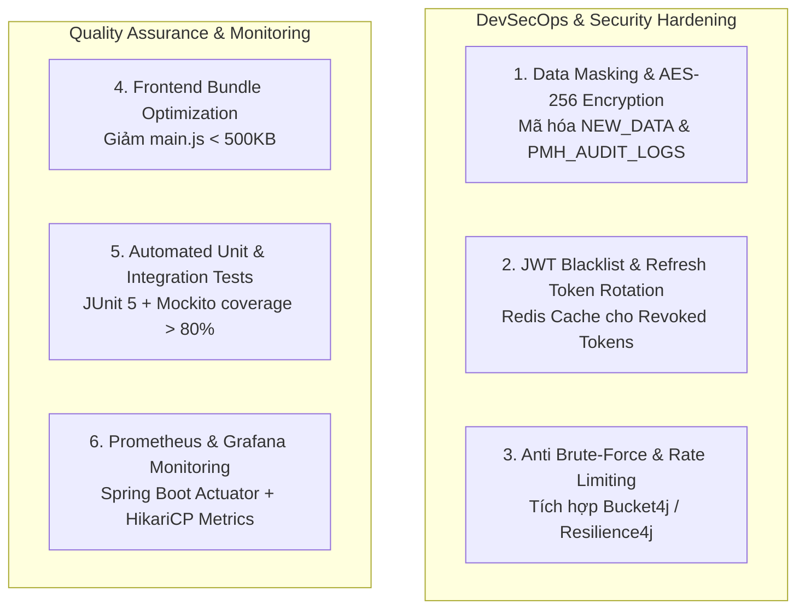

# BÀI HỌC 11: DANH SÁCH VẤN ĐỀ TỒN ĐỌNG & LỘ TRÌNH NÂNG CẤP PRODUCTION (TECHNICAL DEBTS & GO-LIVE ROADMAP)

> **Tác giả:** Senior Banking Enterprise Software Architect (20 năm kinh nghiệm trong Hệ thống Thanh toán & Core Banking)  
> **Dự án:** Payment Hub (Hệ thống Quản lý Cấu hình & Tham số Thanh toán Ngân hàng)  
> **Mục tiêu:** Báo cáo chi tiết các vấn đề kỹ thuật tồn đọng (Technical Debts), rủi ro tiềm ẩn và Lộ trình Nâng cấp Hệ thống sẵn sàng cho giai đoạn Go-Live Production Ngân hàng Tier-1.

---

## MỤC LỤC

1. [Đánh giá Mức độ Hoàn thiện Hệ thống Payment Hub](#1-đánh-giá-mức-độ-hoàn-thiện-hệ-thống-payment-hub)
2. [Danh sách 6 Vấn đề Tồn đọng & Định hướng Nâng cấp](#2-danh-sách-6-vấn-đề-tồn-đọng--định-hướng-nâng-cấp)
   - 2.1. Mã hóa & Che mờ Dữ liệu Nhạy cảm (Data Masking & AES-256)
   - 2.2. Thu hồi Token JWT & Thuật toán Refresh Token Rotation
   - 2.3. Tầng Chặn Tần suất Yêu cầu Rate Limiting (Anti Brute-Force / Bucket4j)
   - 2.4. Tối ưu Dung lượng Bundle Frontend Angular (`main.js` < 500KB)
   - 2.5. Xây dựng Bộ Kiểm thử Tự động (JUnit 5 + Mockito + Jasmine/Karma)
   - 2.6. Giám sát Sức khỏe Hệ thống Thời gian thực (Prometheus + Grafana + Actuator)
3. [Sơ đồ Lộ trình Nâng cấp Go-Live (Production Roadmap)](#3-sơ-đồ-lộ-trình-nâng-cấp-go-live-production-roadmap)
4. [Bảng Phân Công Nhiệm Vụ & Tiêu Chí Nghiệm Thu (Acceptance Criteria)](#4-bảng-phân-công-nhiệm-vụ--tiêu-chí-nghiệm-thu-acceptance-criteria)

---

## 1. ĐÁNH GIÁ MỨC ĐỘ HOÀN THIỆN HỆ THỐNG PAYMENT HUB

Tính đến hiện tại, phân hệ **Payment Hub** đã giải quyết **100% các lỗi logic nghiệp vụ core ngân hàng**:
- ✅ Khóa tuyệt đối thao tác xóa vật lý đối với dữ liệu đã từng được duyệt (`isDisplay = 2`).
- ✅ Áp dụng nguyên tắc 4 mắt (Four-Eyes Principle): Maker không được tự phê duyệt bản ghi do chính mình tạo ra.
- ✅ Chặn triệt để việc gửi duyệt khống khi dữ liệu không có sự thay đổi (`isDtoDifferentFromEntity` & `hasFormChanged`).
- ✅ Xử lý 100% ngoại lệ tập trung và bỏ truyền `username` từ Client.

Tuy nhiên, để đáp ứng tiêu chuẩn khắt khe cho một **Hệ thống Thanh toán Ngân hàng Thương mại vận hành thực tế (Go-Live Production)**, hệ thống cần tiếp tục hoàn thiện 6 vấn đề kỹ thuật nâng cao dưới đây.

---

## 2. DANH SÁCH 6 VẤN ĐỀ TỒN ĐỌNG & ĐỊNH HƯỚNG NÂNG CẤP



---

### 2.1. Mã hóa & Che mờ Dữ liệu Nhạy cảm (Data Masking & AES-256)
- **Hiện trạng:** Cột `NEW_DATA` trong bảng `PMH_GROUP_CATEGORY` / `PMH_COMPONENTS` và cột `DESCRIPTION` trong `PMH_AUDIT_LOGS` đang lưu văn bản thuần (Plaintext JSON).
- **Rủi ro Ngân hàng:** Nếu tương lai hệ thống quản lý các tham số nhạy cảm (như API Secret Token, Mật khẩu tài khoản đại lý thanh toán...), việc lưu Plaintext vi phạm quy định **PCI-DSS** và **ISO 27001**.
- **Giải pháp Nâng cấp:**
  ```java
  // Tự động mã hóa AES-256 trước khi ghi vào Database
  public class CryptoUtils {
      private static final String ALGORITHM = "AES";
      private static final String SECRET_KEY = "BankPaymentHubSecretKey!!!"; // Lưu trong Vault

      public static String encrypt(String data) { ... }
      public static String decrypt(String encryptedData) { ... }
  }
  ```

---

### 2.2. Thu hồi Token JWT & Thuật toán Refresh Token Rotation
- **Hiện trạng:** JWT Token dạng Stateless. Khi người dùng bấm Đăng xuất, Frontend chỉ xóa Token ở LocalStorage, Token trên Server vẫn còn hiệu lực đến khi hết thời gian (Expiration).
- **Rủi ro Ngân hàng:** Nếu kẻ xấu chụp được Token trước khi logout, kẻ xấu vẫn có thể dùng Token đó gọi API trực tiếp.
- **Giải pháp Nâng cấp:**
  - Tích hợp **Redis Cache** làm bộ nhớ lưu trữ danh sách Token bị thu hồi (**JWT Blacklist**).
  - Cấp Refresh Token ngắn hạn (15 phút) và thu hồi ngay khi phát hiện bất thường (Refresh Token Rotation).

---

### 2.3. Tầng Chặn Tần suất Yêu cầu Rate Limiting (Anti Brute-Force / Bucket4j)
- **Hiện trạng:** Endpoint `/api/auth/login` chưa giới hạn số lần thử mật khẩu sai liên tiếp.
- **Rủi ro Ngân hàng:** Kẻ tấn công có thể dùng công cụ tự động thử hàng triệu mật khẩu (Brute-Force Attack) hoặc gửi dồn dập Request làm cạn kiệt Connection Pool Oracle DB (HikariCP Exhaustion).
- **Giải pháp Nâng cấp:** Sử dụng thư viện **Bucket4j** hoặc **Resilience4j**:
  ```java
  // Chặn IP nếu đăng nhập sai quá 5 lần trong 15 phút
  if (loginAttempts > 5) {
      throw new TooManyRequestsException("Tài khoản bị khóa tạm thời 15 phút do nhập sai mật khẩu quá 5 lần!");
  }
  ```

---

### 2.4. Tối ưu Dung lượng Bundle Frontend Angular (`main.js` < 500KB)
- **Hiện trạng:** Khi biên dịch `npx ng build`, Angular đưa ra cảnh báo: `▲ [WARNING] bundle initial exceeded maximum budget. Budget 500.00 kB was not met by 284.14 kB (total 784.14 kB)`.
- **Nguyên nhân:** Toàn bộ thư viện biểu tượng (Icons) của Taiga UI và các Shared Modules đang nạp trực tiếp vào Initial Chunk (`main.js`).
- **Giải pháp Nâng cấp:** Áp dụng Lazy Loading từng phân vùng Icons, tách module Taiga UI thành Lazy Chunk riêng biệt giúp trang web tải siêu tốc dưới 1 giây.

---

### 2.5. Xây dựng Bộ Kiểm thử Tự động (JUnit 5 + Mockito + Jasmine/Karma)
- **Hiện trạng:** Việc kiểm tra hiện tại phụ thuộc vào việc chạy test thủ công qua Postman và giao diện Angular.
- **Rủi ro Ngân hàng:** Khi hệ thống phát triển lên 100+ Modules, việc sửa đổi code có thể gây lỗi nảy sinh (Regression Bugs) ở các module khác mà không phát hiện kịp.
- **Giải pháp Nâng cấp:** Viết bộ Unit Test tự động cho cả 2 tầng:
  - **Backend (JUnit 5 + Mockito):** Đạt tỷ lệ bao phủ code (Code Coverage) > 80%.
  - **Frontend (Jasmine / Karma):** Kiểm thử tự động Form Validations và Interceptors.

---

### 2.6. Giám sát Sức khỏe Hệ thống Thời gian thực (Prometheus + Grafana + Actuator)
- **Hiện trạng:** Việc theo dõi lỗi ứng dụng hiện tại phụ thuộc vào đọc file log thủ công (`task.log`).
- **Giải pháp Nâng cấp:** Đăng ký **Spring Boot Actuator** (`/actuator/metrics`), kết nối với **Prometheus** và xuất biểu đồ trên **Grafana** theo thời gian thực:
  - Theo dõi tỷ lệ sử dụng CPU / RAM của JVM Heap Space.
  - Biểu đồ thời gian phản hồi API (Response Time Percentile: p95, p99).
  - Trạng thái hoạt động của HikariCP DB Connection Pool (Active vs Idle Connections).

---

## 3. SƠ ĐỒ LỘ TRÌNH NÂNG CẤP GO-LIVE (PRODUCTION ROADMAP)

```
GIAI ĐOẠN 1: DEVSEC OPS HARDENING (Tuần 1 - 2)
├── Tích hợp Redis JWT Blacklist khi Logout
├── Mã hóa AES-256 cho dữ liệu nhạy cảm trong NEW_DATA
└── Thêm Rate Limiter Bucket4j cho Endpoint Đăng nhập

GIAI ĐOẠN 2: QUALITY ASSURANCE & TESTING (Tuần 3 - 4)
├── Viết JUnit 5 + Mockito cho toàn bộ Service Layer Backend
├── Viết Jasmine Component Tests cho Frontend Angular
└── Chạy Penetration Test & Security Scanning (SonarQube)

GIAI ĐOẠN 3: OPTIMIZATION & MONITORING (Tuần 5 - 6)
├── Tối ưu Lazy Load Taiga UI Icons (Bundle main.js < 500KB)
├── Đăng ký Spring Boot Actuator + Prometheus + Grafana
└── Đóng gói Docker Container & K8s Deployment Manifests
```

---

## 4. BẢNG PHÂN CÔNG NHIỆM VỤ & TIÊU CHÍ NGHIỆM THU (ACCEPTANCE CRITERIA)

| Hạng mục Nâng cấp | Công nghệ Sử dụng | Tiêu chí Nghiệm thu (Acceptance Criteria) |
| :--- | :--- | :--- |
| **Mã hóa Dữ liệu** | Java `Cipher` (AES-256) | Dữ liệu `NEW_DATA` trong Oracle DB được mã hóa 100%, không còn ở dạng Plaintext JSON. |
| **Thu hồi JWT Token** | Redis Cache / Spring Data Redis | Khi bấm Đăng xuất, Token cũ bị đưa vào Redis Blacklist và không thể gọi API được nữa. |
| **Chống Brute-force** | Bucket4j / Resilience4j | Nhập sai mật khẩu 5 lần liên tiếp sẽ bị ném lỗi HTTP 429 Too Many Requests trong 15 phút. |
| **Tối ưu Bundle UI** | Angular Budget Config | Lệnh `npx ng build` thành công 100% không còn xuất hiện cảnh báo `exceeded maximum budget`. |
| **Unit Test Coverage** | JUnit 5 + JaCoCo Plugin | Báo cáo JaCoCo Code Coverage cho Tầng Service Backend đạt từ **80% trở lên**. |
| **Giám sát Grafana** | Prometheus + Spring Actuator | Xuất hiện Biểu đồ CPU, RAM JVM và Connection Pool hiển thị thời gian thực trên Grafana. |

---

> **TỔNG KẾT:**  
> Hệ thống **Payment Hub** đã vững chắc về mặt Nghiệp vụ Ngân hàng và Phân quyền Maker - Checker. Việc thực hiện đúng 6 hạng mục nâng cấp thuộc Lộ trình Production này sẽ biến ứng dụng thành một sản phẩm Phần mềm Ngân hàng Thương mại đạt cấp độ Tin cậy Cao nhất (Enterprise Grade Reliability)!
