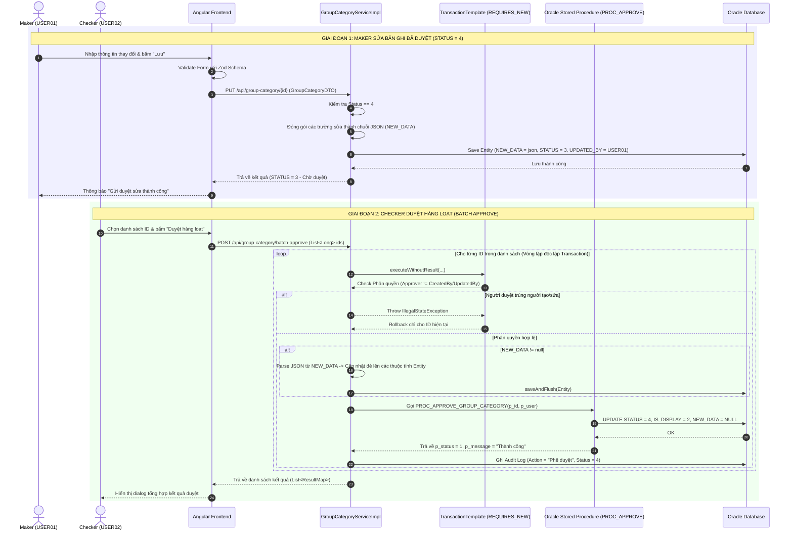

# 🔄 ĐẶC TẢ SƠ ĐỒ TUẦN TỰ (SEQUENCE DIAGRAM SPECIFICATION)

**Dự án:** Payment Hub (PMH)
**Chủ đề:** Quy trình Phê duyệt Hàng loạt (Batch Approve) & Lưu trữ Tạm (`NEW_DATA`)

---

## 1. MÔ TẢ LUỒNG TƯƠNG TÁC KỸ THUẬT

Quy trình xử lý Maker-Checker bao gồm tương tác qua 4 tầng:
1. **Frontend (Angular 17+):** Người dùng thao tác UI, Form Zod validation & Signals.
2. **Backend Controller / Service (Spring Boot):** Tiếp nhận DTO, quản lý `TransactionTemplate` độc lập.
3. **Audit Log Service:** Ghi nhật ký biến động trạng thái.
4. **Database (Oracle Stored Procedure):** Thực thi cập nhật dữ liệu gốc & kiểm soát toàn vẹn.

---

## 2. MERMAID SEQUENCE DIAGRAM

---

## 3. FILE VẼ SƠ ĐỒ TUẦN TỰ DẠNG DRAW.IO
File sơ đồ này được lưu trữ tại [sequence_maker_checker.drawio](file:///e:/PMH/project/docs/diagrams/sequence_maker_checker.drawio) phục vụ cho việc nhúng vào báo cáo đồ án.
