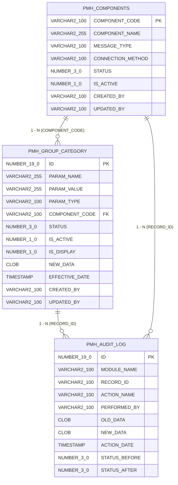

# 🗄️ THIẾT KẾ CƠ SỞ DỮ LIỆU CHI TIẾT (DATABASE DESIGN SPECIFICATION)

**Dự án:** Payment Hub (PMH)
**Hệ quản trị CSDL:** Oracle Database 19c / 21c

---

## 1. MÔ TẢ CÁC BẢNG DỮ LIỆU NGHỆP VỤ

### 1.1 Bảng `PMH_GROUP_CATEGORY` (Danh mục tham số theo nhóm)

| Tên Cột | Kiểu Dữ Liệu | Khóa | Ràng buộc | Ý Nghĩa / Nghiệp Vụ |
| :--- | :--- | :--- | :--- | :--- |
| `ID` | `NUMBER(19,0)` | **PK** | NOT NULL | ID duy nhất (Sequence / Auto-increment). |
| `PARAM_NAME` | `VARCHAR2(255)` | | NOT NULL | Tên tham số danh mục. |
| `PARAM_VALUE` | `VARCHAR2(255)` | | NOT NULL | Giá trị tham số. |
| `PARAM_TYPE` | `VARCHAR2(100)` | | NOT NULL | Loại / Nhóm tham số. |
| `DESCRIPTION` | `VARCHAR2(500)` | | NULLABLE | Mô tả chi tiết. |
| `COMPONENT_CODE`| `VARCHAR2(100)` | **FK** | NULLABLE | Mã cấu phần liên kết với `PMH_COMPONENTS.COMPONENT_CODE`. |
| `STATUS` | `NUMBER(3,0)` | | NOT NULL | Trạng thái: `1` (Mới tạo), `3` (Chờ duyệt), `4` (Đã duyệt), `5` (Từ chối). |
| `IS_ACTIVE` | `NUMBER(1,0)` | | NOT NULL | Cờ kích hoạt: `1` (Hoạt động), `0` (Tắt). |
| `IS_DISPLAY` | `NUMBER(1,0)` | | NOT NULL | Cờ hiển thị: `1` (Chưa từng duyệt), `2` (Đã từng duyệt vận hành). |
| `NEW_DATA` | `CLOB` | | NULLABLE | **Chuỗi JSON chứa dữ liệu thay đổi chờ Checker phê duyệt.** |
| `EFFECTIVE_DATE` | `TIMESTAMP` | | NOT NULL | Ngày bắt đầu hiệu lực. |
| `END_EFFECTIVE_DATE`| `TIMESTAMP` | | NULLABLE | Ngày kết thúc hiệu lực. |
| `CREATED_BY` | `VARCHAR2(100)` | | NOT NULL | Tài khoản Maker tạo bản ghi. |
| `CREATED_DATE` | `TIMESTAMP` | | NOT NULL | Thời điểm tạo bản ghi. |
| `UPDATED_BY` | `VARCHAR2(100)` | | NULLABLE | Tài khoản thao tác gần nhất (Maker/Checker). |
| `UPDATED_DATE` | `TIMESTAMP` | | NULLABLE | Thời điểm thao tác gần nhất. |

> **Ràng buộc duy nhất (Unique Constraint):** `UK_PARAM_GROUP` trên 3 cột `(PARAM_NAME, PARAM_VALUE, PARAM_TYPE)`.

---

### 1.2 Bảng `PMH_COMPONENTS` (Danh mục Cấu phần xử lý)

| Tên Cột | Kiểu Dữ Liệu | Khóa | Ràng buộc | Ý Nghĩa / Nghiệp Vụ |
| :--- | :--- | :--- | :--- | :--- |
| `COMPONENT_CODE` | `VARCHAR2(100)` | **PK** | NOT NULL | Mã định danh cấu phần (Ví dụ: `EVN_NPC`, `PAYMENT_CORE`). |
| `COMPONENT_NAME` | `VARCHAR2(255)` | | NOT NULL | Tên cấu phần xử lý. |
| `MESSAGE_TYPE` | `VARCHAR2(100)` | | NULLABLE | Định dạng tin nhắn (JSON, XML, ISO8583). |
| `CONNECTION_METHOD`| `VARCHAR2(100)`| | NULLABLE | Phương thức kết nối (REST_API, SOAP, SFTP). |
| `STATUS` | `NUMBER(3,0)` | | NOT NULL | Trạng thái phê duyệt (`1`, `3`, `4`, `5`). |
| `IS_ACTIVE` | `NUMBER(1,0)` | | NOT NULL | Trạng thái hoạt động (`1` / `0`). |
| `CREATED_BY` | `VARCHAR2(100)` | | NOT NULL | Người tạo. |
| `CREATED_DATE` | `TIMESTAMP` | | NOT NULL | Ngày tạo. |
| `UPDATED_BY` | `VARCHAR2(100)` | | NULLABLE | Người sửa. |
| `UPDATED_DATE` | `TIMESTAMP` | | NULLABLE | Ngày sửa. |

---

### 1.3 Bảng `PMH_AUDIT_LOG` (Nhật ký kiểm toán biến động)

| Tên Cột | Kiểu Dữ Liệu | Khóa | Ý Nghĩa |
| :--- | :--- | :--- | :--- |
| `ID` | `NUMBER(19,0)` | **PK** | Định danh nhật ký. |
| `MODULE_NAME` | `VARCHAR2(100)` | | Phân hệ tác động (`GROUP_CATEGORY` hoặc `PROCESSING_COMPONENT`). |
| `RECORD_ID` | `VARCHAR2(100)` | | ID hoặc Code của bản ghi bị tác động. |
| `ACTION_NAME` | `VARCHAR2(100)` | | Tên hành động (`Tạo mới`, `Gửi duyệt`, `Phê duyệt`, `Từ chối`, `Hủy sửa`, `Xóa`). |
| `PERFORMED_BY` | `VARCHAR2(100)` | | Tài khoản thực hiện. |
| `OLD_DATA` | `CLOB` | | Dữ liệu dạng JSON trước khi thao tác. |
| `NEW_DATA` | `CLOB` | | Dữ liệu dạng JSON sau khi thao tác. |
| `ACTION_DATE` | `TIMESTAMP` | | Thời điểm ghi nhận. |
| `STATUS_BEFORE` | `NUMBER(3,0)` | | Trạng thái trước thao tác. |
| `STATUS_AFTER` | `NUMBER(3,0)` | | Trạng thái sau thao tác. |

---

## 2. SƠ ĐỒ THỰC THỂ CƠ SỞ DỮ LIỆU (ERD)

