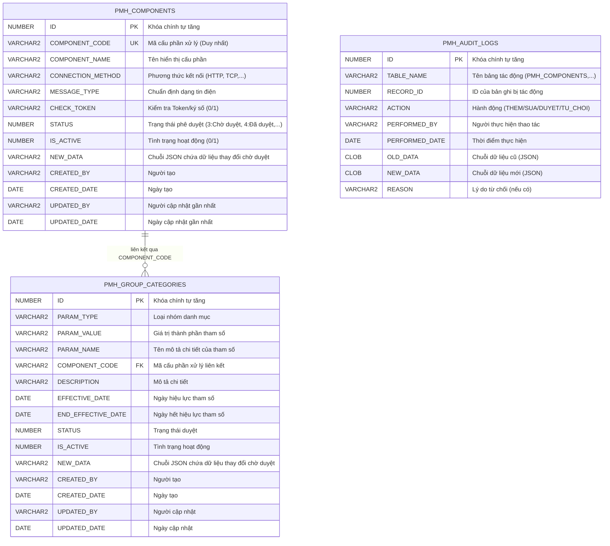

# Sơ đồ Quan hệ Cơ sở dữ liệu (ERD Schema)
Dưới đây là sơ đồ thực thể mối quan hệ cơ sở dữ liệu của các bảng cấu hình tham số trong Oracle Database.

Sơ đồ sử dụng cú pháp **Mermaid Markdown**. Bạn có thể sử dụng các công cụ đọc Mermaid để xem trực quan sơ đồ quan hệ.

