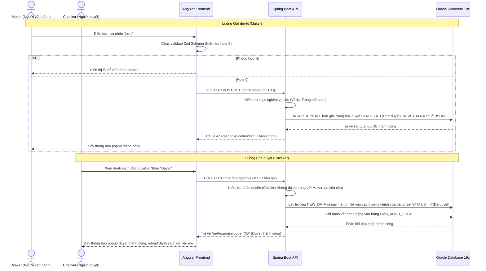

# Luồng hoạt động hệ thống (System Workflows)
Dưới đây là sơ đồ tuần tự (Sequence Diagram) mô tả luồng kiểm duyệt kép Maker - Checker khi thực hiện thay đổi tham số hệ thống.

```mermaid
sequenceDiagram
    actor Maker as Maker (Người vận hành)
    actor Checker as Checker (Người duyệt)
    participant UI as Angular Frontend
    participant API as Spring Boot API
    participant DB as Oracle Database 19c
    
    %% Luồng gửi duyệt của Maker
    Note over Maker, DB: Luồng Gửi duyệt (Maker)
    Maker->>UI: Điền form và nhấn "Lưu"
    UI->>UI: Chạy validate Zod Schema (Kiểm tra hợp lệ)
    alt Không hợp lệ
        UI-->>Maker: Hiển thị lỗi đỏ trên form control
    else Hợp lệ
        UI->>API: Gửi HTTP POST/PUT (chứa thông tin DTO)
        API->>API: Kiểm tra logic nghiệp vụ sâu (Ví dụ: Trùng mã code)
        API->>DB: INSERT/UPDATE bản ghi: trạng thái duyệt STATUS = 3 (Chờ duyệt), NEW_DATA = chuỗi JSON
        DB-->>API: Trả về kết quả lưu DB thành công
        API-->>UI: Trả về ApiResponse code="00" (Thành công)
        UI-->>Maker: Đẩy thông báo popup thành công
    end
    
    %% Luồng phê duyệt của Checker
    Note over Checker, DB: Luồng Phê duyệt (Checker)
    Checker->>UI: Xem danh sách chờ duyệt & Nhấn "Duyệt"
    UI->>API: Gửi HTTP POST /api/approve (Mã ID bản ghi)
    API->>API: Kiểm tra phân quyền (Checker không được trùng với Maker tạo yêu cầu)
    API->>DB: Lấy trường NEW_DATA ra giải mã, ghi đè vào các trường chính của bảng, set STATUS = 4 (Đã duyệt)
    API->>DB: Ghi nhận vết hành động vào bảng PMH_AUDIT_LOGS
    DB-->>API: Phản hồi cập nhật thành công
    API-->>UI: Trả về ApiResponse code="00" (Duyệt thành công)
    UI-->>Checker: Đẩy thông báo popup duyệt thành công, reload danh sách dữ liệu mới
```
