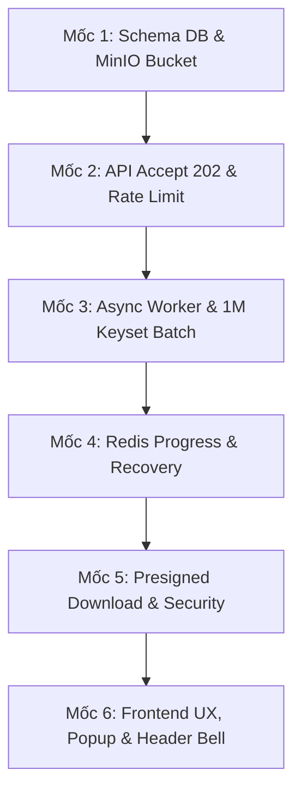

# Danh Sách Các Mốc Kiểm Tra (Checklist Nghiệm Thu) - Bài Toán Xuất 1 Triệu Bản Ghi Transaction Log

Tài liệu này dùng để theo dõi tiến độ và kiểm tra tính **ĐÚNG** và **ĐỦ** trong quá trình triển khai bài toán **Xuất dữ liệu 1.000.000+ bản ghi sang file CSV** theo đúng tài liệu thiết kế [export_1tr.md](file:///e:/PMH/project/docs/RSD/export_1tr.md).

---

## 🛠️ PHẦN 0: CHUẨN BỊ BẮT ĐẦU (PRE-IMPLEMENTATION SETUP)

> [!IMPORTANT]
> Cần đảm bảo các thành phần bên dưới đã sẵn sàng trước khi tiến hành viết code cho Backend & Frontend.

- [ ] **1. Script Database Oracle**:
  - [x] Đã có bảng `EXPORT_JOB` trên Oracle DB (Đảm bảo có đủ 14 cột).
  - [x] Bảng `TRANSACTION_LOG` đã tạo thành công Composite Index `IDX_TXN_LOG_FILTER (CREATED_AT, STATUS, ACCOUNT_NO, ID)`.
- [ ] **2. Hạ tầng Redis**:
  - [ ] Redis đang chạy và kết nối ổn định từ Spring Boot backend (`localhost:6379`).
- [ ] **3. Hạ tầng MinIO Object Storage**:
  - [ ] Instance MinIO đang chạy (Dev local: `http://localhost:9000`).
  - [ ] Bucket `export-logs` đã được tạo.
  - [ ] Đã cài đặt **Bucket Lifecycle Rule**: Tự động xóa vĩnh viễn file tạm sau **12 tiếng** (`Expiration: 12 Hours`).
- [x] **4. Thư viện Backend (`pom.xml`)**:
  - [x] Đã thêm SDK `minio` (Java MinIO client `8.5.12`).
  - [x] Đã thêm `commons-csv` (Apache Commons CSV `1.11.0`).
  - [x] Đã thêm `shedlock-spring` + `shedlock-provider-redis-spring` (`5.13.0`).
  - [x] Đã thêm `spring-boot-starter-data-redis`.

---

## 🎯 PHẦN 1: DỤNG CỤ VÀ 6 MỐC KIỂM TRA (CHECKPOINTS)

---

### 📍 MỐC 1: KIỂM TRA DATABASE SCHEMA & HẠ TẦNG LƯU TRỮ

| STT | Hạng mục kiểm tra | Cách thức kiểm tra / Câu lệnh | Trạng thái |
|:---:|-------------------|-------------------------------|:----------:|
| 1.1 | Đủ 14 cột bảng `EXPORT_JOB` | `DESC EXPORT_JOB;` trên Oracle SQL Developer / DBeaver | [ ] |
| 1.2 | Composite Index `IDX_TXN_LOG_FILTER` | `SELECT index_name FROM user_indexes WHERE table_name = 'TRANSACTION_LOG';` | [ ] |
| 1.3 | MinIO Bucket `export-logs` tồn tại | Truy cập MinIO Console (`http://localhost:9001`) hoặc gọi MinIO Client | [ ] |
| 1.4 | Lifecycle Rule 12h trên MinIO | Kiểm tra tab Lifecycle Rules trên MinIO Console cho bucket `export-logs` | [ ] |

---

### 📍 MỐC 2: API KHỞI TẠO JOB (HTTP 202 ACCEPTED) & KHẢ NĂNG TẢI (RATE LIMITING)

> [!TIP]
> Kiểm tra phản hồi cực nhanh < 100ms và cơ chế chặn spam bằng Postman hoặc `curl`.

- [ ] **2.1. Response tốc độ cao (< 100ms)**:
  - Call `POST /api/v1/transaction-log/export-jobs` kèm body bộ lọc.
  - **Kỳ vọng**: Trả về status `HTTP 202 Accepted` chứa `jobId`, thời gian phản hồi `< 100ms`.
- [ ] **2.2. Chống Spam Request theo User (Per-User Lock)**:
  - Sử dụng 1 user token, gửi 2 request `POST /export-jobs` liên tục trong vòng 1 giây.
  - **Kỳ vọng**: Request thứ 2 lập tức bị chặn và trả về `HTTP 409 Conflict` kèm thông báo *"Đang có yêu cầu xuất đang xử lý"*.
- [ ] **2.3. Giới hạn toàn hệ thống (Global Backpressure & Rate Limit)**:
  - Giả lập 4 users gửi 4 yêu cầu tạo job xuất file cùng lúc.
  - **Kỳ vọng**: 3 job đầu được chấp nhận xử lý (`202 Accepted`), job thứ 4 xếp vào ThreadPool Queue (tối đa 10).
  - Giả lập gửi > 13 jobs cùng lúc $\rightarrow$ Các request vượt quá bị từ chối với `HTTP 503 Service Unavailable`.

---

### 📍 MỐC 3: ASYNC WORKER, CƠ CHẾ KEYSET BATCHING & CHUẨN HÓA FILE CSV

- [ ] **3.1. Phân trang Keyset Cursor (`WHERE ID <= :maxExportId AND ID > :lastId`)**:
  - Kiểm tra log query của Hibernate / Spring Data JDBC khi xuất 1 triệu bản ghi.
  - **Kỳ vọng**: Không sử dụng `OFFSET`, câu SQL đọc theo từng batch 10.000 dòng. RAM của Backend Spring Boot không tăng đột biến (không OOM).
- [ ] **3.2. Đảm bảo Ranh giới Snapshot (`MAX_EXPORT_ID`)**:
  - Khi Job vừa chuyển sang `PROCESSING`, insert thủ công 1 dòng mới vào bảng `TRANSACTION_LOG`.
  - **Kỳ vọng**: Bản ghi mới thêm vào **không xuất hiện** trong file CSV kết quả xuất ra.
- [ ] **3.3. Định dạng CSV UTF-8 BOM & Chuẩn RFC 4180**:
  - Mở file `.csv` vừa tạo bằng Microsoft Excel.
  - **Kỳ vọng**:
    - Hiển thị chuẩn tiếng Việt có dấu (không bị lỗi font).
    - Các trường có chứa dấu phẩy, dấu nháy kép `"`, xuống dòng `\n` không làm lệch cột Excel.
    - Ký tự nguy hiểm ở đầu chuỗi (`=`, `+`, `-`, `@`) được sanitize chống CSV Injection.
- [ ] **3.4. Upload MinIO & Cleanup File Tạm**:
  - Kiểm tra thư mục tạm local sau khi xuất hoàn tất.
  - **Kỳ vọng**: File temp trên đĩa cứng server bị xóa sạch (`finally` block). File CSV chính thức nằm trên MinIO `export-logs/`.

---

### 📍 MỐC 4: POLLING TIẾN ĐỘ QUA REDIS & TỰ ĐỘNG PHỤC HỒI LỖI (RECOVERY)

- [ ] **4.1. Cache Tiến độ trên Redis (Triệt tiêu Query DB)**:
  - Khi Worker đang chạy, gọi `GET /api/v1/transaction-log/export-jobs/active` 3s/lần.
  - **Kỳ vọng**: Backend lấy % số dòng từ Redis Key `export:job:{jobId}:progress` và trả về nhanh (< 5ms). Không có bất kỳ query `SELECT COUNT` nào dội vào Oracle Database.
- [ ] **4.2. Tự động chuyển FAILED khi Worker bị Crash**:
  - Tạo 1 job xuất file lớn, sau đó Stop/Kill đột ngột ứng dụng Spring Boot giữa chừng.
  - Khởi động lại ứng dụng Spring Boot.
  - **Kỳ vọng**: `ExportRecoveryScheduler` (chạy bảo vệ bởi ShedLock) tự động phát hiện `LAST_HEARTBEAT_AT > 5 phút` và đổi trạng thái job thành `FAILED`.

---

### 📍 MỐC 5: TẢI FILE QUA PRESIGNED URL & PHÂN QUYỀN (ANTI-IDOR)

> [!WARNING]
> Tuyệt đối không stream file từ Spring Boot ra client để tránh tốn ThreadPool và RAM của Server Backend.

- [ ] **5.1. MinIO Presigned URL**:
  - Gọi API `GET /api/v1/transaction-log/export-jobs/{jobId}/download`.
  - **Kỳ vọng**: Trả về Presigned URL của MinIO thời hạn 12h. Trình duyệt tải trực tiếp từ MinIO, không qua Spring Boot Server.
- [ ] **5.2. Kiểm tra Ownership (Anti-IDOR)**:
  - Dùng token của User A để gọi API download `jobId` do User B tạo ra.
  - **Kỳ vọng**: Trả về `HTTP 403 Forbidden` (User A không thể tải file của User B).

---

### 📍 MỐC 6: TRẢI NGHIỆM GIAO DIỆN FRONTEND & POPUP XÁC NHẬN

- [ ] **6.1. Popup Xác Nhận (Confirm Dialog)**:
  - Người dùng bấm nút **"Xuất file"**:
    - **Trường hợp có bộ lọc**: Popup hiển thị thông báo: *"Bạn có chắc chắn muốn xuất dữ liệu giao dịch theo bộ lọc hiện tại sang file CSV?"*.
    - **Trường hợp không lọc (form rỗng)**: Popup cảnh báo: *"Bạn có chắc chắn muốn xuất toàn bộ dữ liệu nhật ký giao dịch (1.000.000+ bản ghi) sang file CSV?"*.
- [ ] **6.2. Hiển thị Progress & Toast Auto-Download**:
  - Sau khi xác nhận trên Popup:
    - Nút "Xuất file" bị `disabled`, hiển thị spinner.
    - Toast tiến độ cập nhật real-time: *"Đang xử lý: X / Y dòng (Z%)"*.
    - Khi hoàn thành: Toast Success hiện lên, file tự động kích hoạt tải về.
- [ ] **6.3. Header Notification Center (Quả chuông)**:
  - Click vào Icon Quả chuông trên Header:
    - Hiển thị danh sách các file xuất trong **12 tiếng gần nhất** của user.
    - Có đếm ngược thời gian lưu trữ file local (`Còn hiệu lực: HH:mm:ss`).
    - Nút `[Tải về]` hoạt động chuẩn xác khi bấm lại.
- [ ] **6.4. Khôi phục trạng thái khi F5 / Mở lại Trình duyệt**:
  - Nhấn F5 hoặc tắt trình duyệt mở lại khi đang xuất file.
  - **Kỳ vọng**: Web tự động gọi `GET /my-jobs`, kích hoạt lại polling progress và thông báo vạch đỏ trên Icon Quả chuông.

---

## 📝 BẢNG TỔNG HỢP TIẾN ĐỘ THỰC HIỆN

| Mốc | Tên mốc kiểm tra | Tổng số checklist | Đã đạt | Tỷ lệ hoàn thành |
|:---:|------------------|:-----------------:|:------:|:----------------:|
| **Mốc 1** | Schema DB & MinIO Storage | 4 | 0 | 0% |
| **Mốc 2** | API Accept 202 & Rate Limit | 3 | 0 | 0% |
| **Mốc 3** | Async Worker & 1M Keyset Batch | 4 | 0 | 0% |
| **Mốc 4** | Redis Progress & Recovery | 2 | 0 | 0% |
| **Mốc 5** | Presigned Download & Security | 2 | 0 | 0% |
| **Mốc 6** | Frontend UX, Popup & Header Bell | 4 | 0 | 0% |
| **TỔNG** | **Toàn bộ bài toán Export 1M** | **19** | **0** | **0%** |
