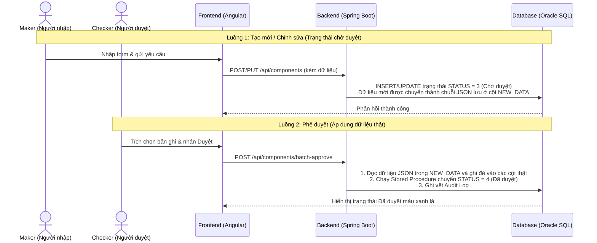

# HƯỚNG DẪN DEMO MÃ NGUỒN DỰ ÁN PAYMENT HUB (CODE WALKTHROUGH GUIDE)

Tài liệu này cung cấp kịch bản chi tiết giúp bạn thuyết trình, hướng dẫn và demo mã nguồn dự án **Payment Hub Configuration Management** cho một người chưa từng làm việc với dự án hoặc chưa am hiểu sâu về công nghệ (Angular & Spring Boot).

Mục tiêu là giúp người nghe hiểu được **luồng đi của dữ liệu**, **cơ chế kiểm soát rủi ro Maker-Checker** và sự chuyên nghiệp trong cấu trúc dự án.

---

## 🗺️ TỔNG QUAN LUỒNG ĐI CỦA CODE (BẢN ĐỒ DỮ LIỆU)

Để bắt đầu, hãy vẽ hoặc giải thích luồng đi của dữ liệu qua 3 tầng (Frontend -> Backend -> Database):

---

## 🎬 KỊCH BẢN DEMO CHI TIẾT (STEP-BY-STEP DEMO SCRIPT)

### PHẦN 1: DEMO TẦNG FRONTEND (GIAO DIỆN & TƯƠNG TÁC NGƯỜI DÙNG)
*Bắt đầu demo từ thư mục: `frontend/src/app`*

#### 1. Màn hình danh sách (Giao diện hiển thị phản ứng nhanh)
*   **Mở File:** [component-list.html](file:///e:/PMH/code/frontend/src/app/features/processing-components/components/component-list/component-list.html) & [component-list.ts](file:///e:/PMH/code/frontend/src/app/features/processing-components/components/component-list/component-list.ts)
*   **Giải thích cho người nghe:** 
    *   *“Đây là code giao diện hiển thị danh sách các Cấu phần xử lý. Bạn thấy giao diện rất mượt mà nhờ công nghệ **Angular Standalone Components** kết hợp bộ thư viện cao cấp **Taiga UI** của Yandex.”*
    *   *“Giao diện hỗ trợ song ngữ (Anh - Việt) thay đổi tức thì mà không cần load lại trang nhờ sử dụng cơ chế **Signals** mới nhất của Angular 17+ (giúp tối ưu hóa bộ nhớ và cập nhật giao diện theo thời gian thực).”*
*   **Đoạn Code ấn tượng để chỉ cho họ xem:**
    *   Trong `component-list.ts`, trỏ vào biến `components = signal<ProcessingComponentResponse[]>([]);`.
    *   Giải thích: *“Đây là biến lưu trữ danh sách dạng tín hiệu (Signal). Bất kỳ khi nào dữ liệu từ server thay đổi, giao diện sẽ tự vẽ lại đúng phần đó chứ không cần render lại cả trang.”*

#### 2. Kết nối và gọi API (Service Layer)
*   **Mở File:** [component.service.ts](file:///e:/PMH/code/frontend/src/app/features/processing-components/services/component.service.ts)
*   **Giải thích cho người nghe:**
    *   *“Tầng Service đóng vai trò như 'người đưa thư'. Khi người dùng click nút Duyệt hoặc sửa đổi cấu phần, Angular Component không tự làm việc với cơ sở dữ liệu mà sẽ gọi qua Service này để gửi yêu cầu mạng (HTTP Request) lên Backend.”*
*   **Đoạn Code ấn tượng để chỉ cho họ xem:**
    *   Hàm `batchApprove` gửi danh sách mã cấu phần lên backend qua giao thức POST.

---

### PHẦN 2: DEMO TẦNG BACKEND (SPRING BOOT - XỬ LÝ NGHIỆP VỤ & VALIDATION)
*Bắt đầu demo từ thư mục: `backend/src/main/java/com/example/paymenthub`*

#### 1. Đón nhận yêu cầu và Kiểm tra dữ liệu đầu vào (Controller & Validation)
*   **Mở File:** [ComponentController.java](file:///e:/PMH/code/backend/src/main/java/com/example/paymenthub/controller/ComponentController.java)
*   **Giải thích cho người nghe:**
    *   *“Đây là Backend Controller - cổng đón nhận tất cả các yêu cầu từ giao diện gửi lên. Để đảm bảo an toàn hệ thống, mọi dữ liệu đầu vào đều phải đi qua bộ lọc kiểm tra nghiêm ngặt (Validation) trước khi cho phép lưu trữ.”*
*   **Đoạn Code ấn tượng để chỉ cho họ xem:**
    *   Chỉ vào chú thích `@Valid` trong các API tạo mới/cập nhật. Giải thích: *“Bộ lọc tự động kiểm tra định dạng dữ liệu đầu vào, nếu sai quy tắc (ví dụ: ngày hiệu lực trống, mã cổng chứa ký tự đặc biệt) hệ thống sẽ từ chối ngay lập tức ở cửa ngõ này.”*

#### 2. Xử lý logic nghiệp vụ và Quản lý giao dịch (Service & Transaction)
*   **Mở File:** [ComponentServiceImpl.java](file:///e:/PMH/code/backend/src/main/java/com/example/paymenthub/service/impl/ComponentServiceImpl.java)
*   **Giải thích cho người nghe:**
    *   *“Đây là trái tim xử lý của hệ thống. Nó chứa toàn bộ logic nghiệp vụ Maker-Checker. Ở đây có một cơ chế cực kỳ quan trọng là **Transaction Management** (Quản lý giao dịch). Nếu một lệnh duyệt hàng loạt gồm nhiều phần nhỏ bị lỗi ở bất kỳ bước nào, hệ thống sẽ tự động khôi phục (Rollback) lại trạng thái ban đầu để tránh làm sai lệch dữ liệu.”*
*   **Đoạn Code ấn tượng để chỉ cho họ xem:**
    *   Trỏ vào dòng `TransactionTemplate transactionTemplate = new TransactionTemplate(transactionManager);` và `transactionTemplate.setPropagationBehavior(TransactionDefinition.PROPAGATION_REQUIRES_NEW);` tại dòng 282-283.
    *   Giải thích: *“Dòng code này đảm bảo mỗi cấu phần được duyệt trong một giao dịch độc lập hoàn toàn. Bản ghi nào duyệt lỗi thì chỉ rollback bản ghi đó, không ảnh hưởng đến các bản ghi khác trong cùng danh sách chọn duyệt hàng loạt.”*

---

### PHẦN 3: DEMO TẦNG CƠ SỞ DỮ LIỆU (ORACLE SQL & AUDIT LOG GHI VẾT)
*Bắt đầu demo từ thư mục: `backend/src/main/resources/db/migration`*

#### 1. Stored Procedure & Trách nhiệm phê duyệt kiểm soát rủi ro
*   **Mở File:** [V1__Init_Tables.sql](file:///e:/PMH/code/backend/src/main/resources/db/migration/V1__Init_Tables.sql)
*   **Giải thích cho người nghe:**
    *   *“Để đảm bảo an toàn tuyệt đối cho hệ thống ngân hàng, việc thay đổi trạng thái dữ liệu thật không chạy trực tiếp bằng các lệnh Java mà được giao hoàn toàn cho **Stored Procedure** chạy trực tiếp bên trong nhân của hệ quản trị cơ sở dữ liệu Oracle Database.”*
*   **Đoạn Code ấn tượng để chỉ cho họ xem:**
    *   Stored Procedure `PROC_APPROVE_COMPONENT` (dòng 116-144).
    *   Giải thích: *“Thủ tục này nhận mã cấu phần, thực hiện cập nhật trạng thái đã duyệt (`STATUS = 4`), đồng thời chuyển đổi quyền hiển thị để áp dụng cấu hình mới. Mọi thao tác đều được bọc trong lệnh COMMIT/ROLLBACK bảo mật.”*

#### 2. Nhật ký ghi vết (Audit Log) để thanh tra giám sát
*   **Mở File:** [AuditLogController.java](file:///e:/PMH/code/backend/src/main/java/com/example/paymenthub/controller/AuditLogController.java) hoặc bảng `PMH_AUDIT_LOG`.
*   **Giải thích cho người nghe:**
    *   *“Bất kỳ hệ thống tài chính nào cũng bắt buộc phải có tính minh bạch. Dự án này tự động ghi lại lịch sử (Audit Log) chi tiết cho từng hành động: Ai làm gì? Lúc nào? Giá trị trước khi sửa là gì? Giá trị sau khi duyệt là gì? Điều này phục vụ hoàn hảo cho công tác hậu kiểm và thanh tra ngân hàng.”*

---

## 💡 ĐIỂM SÁNG CÔNG NGHỆ CỦA DỰ ÁN (WOW POINTS)

Khi giới thiệu dự án, bạn nên đặc biệt nhấn mạnh vào **4 điểm sáng công nghệ** sau để người nghe (ngay cả khi không biết gì về code) thấy được độ hoàn thiện cao của dự án:

1.  **Cơ chế Maker-Checker bảo mật cao:** Dữ liệu chỉnh sửa không bao giờ cập nhật ngay vào bảng thật, mà được chuyển đổi sang dạng chuỗi JSON nén lưu ở cột tạm `NEW_DATA` (trạng thái Chờ duyệt). Chỉ khi người duyệt (Checker) nhấn nút Phê duyệt thì dữ liệu JSON mới được phục hồi và áp dụng chính thức.
2.  **Oracle Stored Procedure làm lõi:** Đảm bảo tối đa tốc độ xử lý dữ liệu và tính toàn vẹn hệ thống ngay tại tầng database.
3.  **Quản lý Transaction cô lập (Requires New):** Tránh hiện tượng lỗi lan truyền khi phê duyệt hàng loạt.
4.  **Angular 17 Signals:** Công nghệ quản lý trạng thái hiện đại nhất của Google giúp giao diện nhanh như chớp và tiết kiệm tài nguyên trình duyệt.
